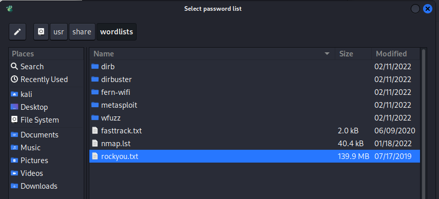
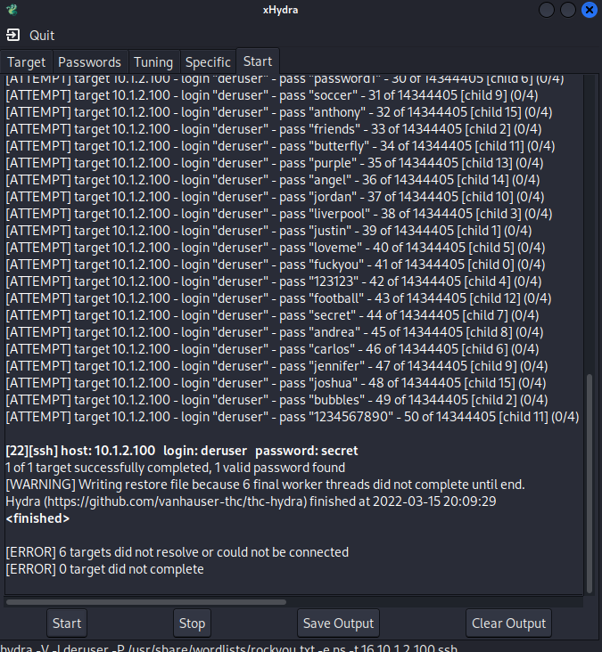

## Brute Forcing SSH Passwords

Let’s imagine we have information from our OSINT searches that there is a "deruser" 
account on the device. Perhaps this user has SSH permissions to the DER device? Let’s 
see if there is a weak password on the system.

1. In December 2009, a company, RockYou, had a data breach of over 32 million user 
accounts. The stolen data included millions of unhashed passwords from users and 
their accounts to Facebook, Myspace, and webmail services. This list of passwords 
was sorted into the most common passwords. We can see them in the Kali VM. Open a 
terminal and enter the following to list the most popular 50 passwords:

    `head -n 50 /usr/share/wordlists/rockyou.txt`

2. Now let’s see if one of these common passwords is used on the DER. Start xhydra by typing the following.

	`xhydra`

3. In the application, set **Single Target** to the DER (10.10.0.100), the protocol 
to ssh, and check the **Show Attempts** option.

	

4. In the Passwords tab, enter the username `deruser` and then select the password 
wordlist by navigating from the File System to `/usr/share/wordlists/rockyou.txt`.

	

5. Try the login (deruser) as the password and try an empty password. Click the 
**Login as Password** and **Try empty password** boxes.

	

6. Go to the Start Tab and click **start**. Hydra uses multiple SSH connections to brute 
force the password of this user. Very quickly the password is discovered to be `secret`. 

	

7. Let’s see if this password works. Open a terminal and enter the following: 

    `ssh deruser@10.10.0.100`

	If prompted to accept the key fingerprint, type: `yes`
	
    Enter the password: `secret`
    
    You will see that you’re now logged into the DER system as the deruser. This is bad for the asset owner because the hacker now has access to the unencrypted data on the DER, user accounts, software, and programs the deruser has access to.

	

8. Let’s see if you have access to the users and passwords files that are located in 
   `/etc/passwd` and `/etc/shadow` in the DER device. Enter the following in the ssh session: 

    `sudo cat /etc/passwd`
	
    `secret`
    
	
	
    As you can see, this user does not have access to those files. This attempt is logged 
    into the file `/var/log/auth.log`. Good cybersecurity practice would be to analyze these 
    host-based alerts for suspicious activity. In some cases, it would be good to upload this 
    data to cloud applications for further analysis.
    
    Log data looks like this: 
	
	`Mar 15 18:16:34 raspberrypi sudo: deruser : user NOT in sudoers; TTY=pts/1 ; PWD=/ ; USER=root ; COMMAND=/bin/cat /etc/passwd`

### Lab 2 – Lessons Learned

Default services and default credentials must be configured and should be with strong, 
unique passwords. Known or default passwords are easily exploited by an adversary to 
misuse the environment and achieve impacts. Monitoring and alerting of communications 
to and from devices would also help organizations identify and contain an attack when 
anomalous remote connections are established.

** Exercise and Lab Complete **
