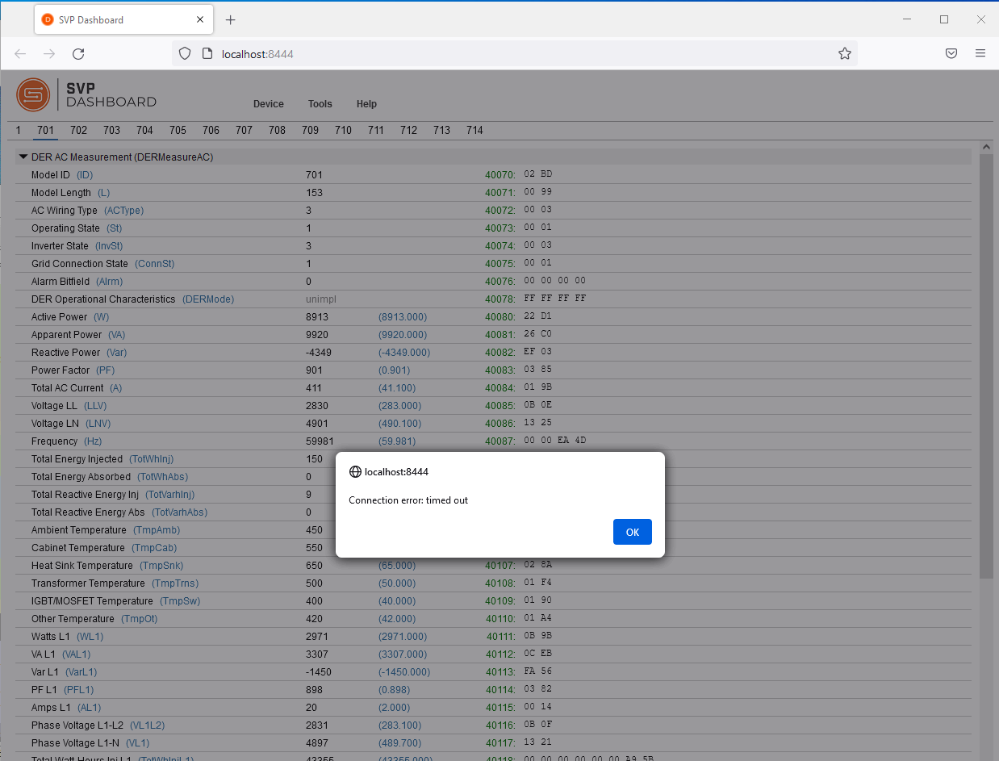
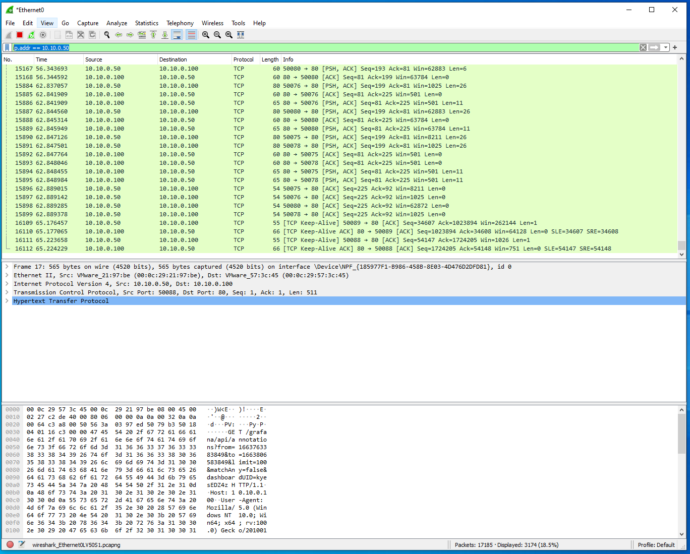
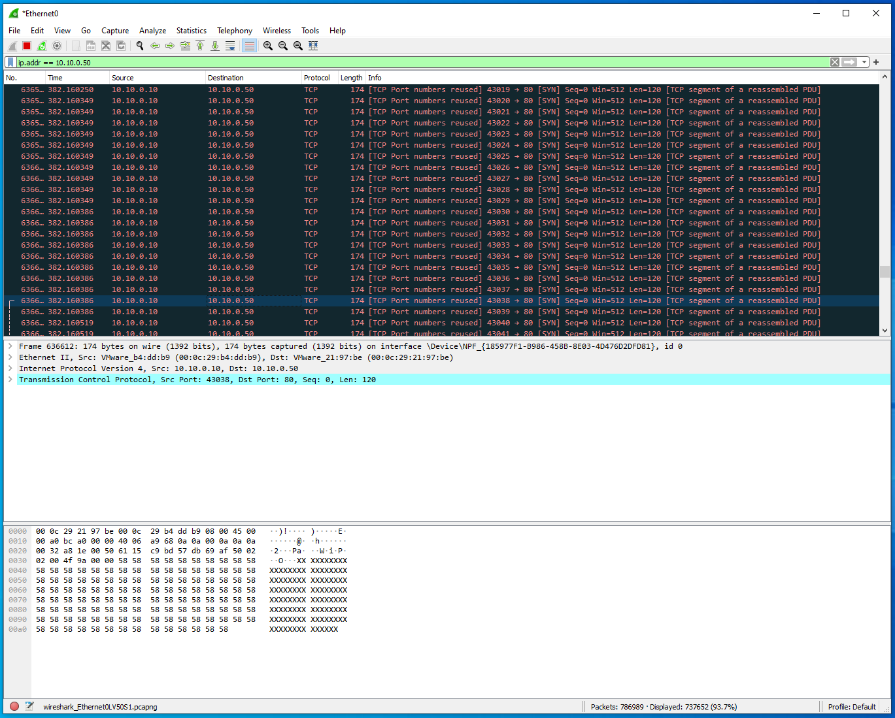

# Denial of Service (DOS)

1. On the Windows DERMS machine open the SVP Dashboard on the Desktop. Once the application opens, click on the link to open `http://localhost:8444` in the Firefox browser. 

	

2. In the browser, go to `Device` -> `Open...` and enter the following:

	`Device Type: Modbus TCP`  
	`IP Address: 10.10.0.100`  
	`IP Port: 502`  
	`Slave ID: 1`  
	`Timeout (secs): 5`

	Click `Open`. 

3. Click through the SunSpec Modbus Models listed at the top: 1, 701, 702, etc.  The 700-series models were created to be complient to the IEEE 1547-2018 DER Interconnection Standards and includes a range of measurement and control features.  The SunSpec Model type is included at the top of the Modbus Register list. For instance, Model 701 is the DER AC Measurement model, `DERMeasureAC`.  If you click on the `Read` button at the bottom of the screen for this model you will see the live power data being updated in real time as this client reaches out to the Modbus Server running on the DER device.  

	

	The columns represent:
	* Modbus Register names and units
	* Raw Modbus values (that have not been scaled by the `_SF` registers)
	* Actual value after scaling (Blue)
	* Modbus Register (Green)
	* Hex values in the Register(s) 

	Spend some time looking through the different Models and the functionality they represent. 


	| IEEE Std 1547-2018 Interoperability Functionality | SunSpec Modbus Information Model |
	|:--------------------------------------------------|:---------------------------------|
	| Nameplate Information | DERCapacity (702), DERStorageCapacity (713) |
	| Configuration Information | DERCapacity (702) | 
	| Monitoring Information | DERMeasurementAC (701) |
	| Constant Power Factor | DERCtlAC (704) | 
	| Voltage-Reactive Power | DERVoltVar (705) | 
	| Active Power-Reactive Power | DERWattVar (712) | 
	| Constant Reactive Power | DERCtlAC (704) | 
	| Voltage-Active Power | DERVoltWatt (706) | 
	| Voltage Trip | DERTripLV (707), DERTripHV (708) | 
	| Momentary Cessation (optional) | DERTripLV (707), DERTripHV (708) | 
	| Frequency Trip | DERTripLF (709), DERTripHF (710) | 
	| Frequency Droop | DERFreqDroop (711) | 
	| Enter Service | DEREnterService (703) | 
	| Cease to Energize and Trip | DEREnterService (703) | 
	| Limit Maximum Active Power | DERCtlAC (704) | 

	SunSpec Modbus is one of three communication protocols required by IEEE Std. 1547-2018.  The other two options for vendors are IEEE 2030.5 and IEEE 1815 (DNP3).
	
4. On the Windows machine, open another tab in the Firefox browser and go to `10.10.0.100`.

	

	You should see that the data is updating regularly. 

5. On the Kali VM, open a terminal.  We will be using `Hping3` to launch a DOS attack on the DER device.  Let's look at the manual for the tool with `man hping3`. 

	Notice we can set the speed of packets with the `--fast`, `--faster`, and `--flood` options.  The protocol is indicated with `--icmp`, `--udp`, or `--rawip`; `-p` sets the destination port; `-V` sets verbose mode; `--data` sets the packet size; and `--syn` Sets the SYN tcp flag. 

6. We will flood the DER Modbus Server using the following command: 

	```
	sudo hping3 --data 120 --syn -p 502 --flood -V 10.10.0.100
	```

7. Return to the SVP Dashboard on the Windows machine and attempt to read Modbus registers. The SVP Dashboard should produce a timeout or other error because it is unable to reach the device. 

	

8. Go back to the Kali machine and cancel the DOS attack with `Ctrl` + `c`.  Notice the number of packets that were sent during the attack. 

	

9. Return to SVP Dashboard on the Windows machine and click through the error messages.  Reconnect to the DER simulator via `Device` -> ` Open...`.  Attempt to read the Modbus holding registers again and see that the DER is working as expected once again. 

10. Now, let's attempt to DOS the DER webserver.  This service is running on port 80, so we'll change our attack on the Kali machine to the following. 

	```
	sudo hping3 --data 120 --syn -p 80 --flood -V 10.10.0.100
	```
	
11. From the Windows DERMS machine, attempt to interact with the DER website at `10.10.0.100`. It should be noticeably slower to respond.  If you watch and/or refresh the home screen, there may be some errors. 

	

	In the case of Distributed Denial of Service (DDOS) attacks 1000+ machines, often in a botnet, are pointed to a webserver or other service to take it offline.  As shown here a single attacker can significantly disrupt communications from a DER to a DERMS system.  More attacker systems sending traffic to DER systems will only worsen the response time of legitimate requests. 

	Switch back to the Kali VM and cancel the attack with `ctrl` + `c`. 

12. **The following steps are optional if you have extra time.** To get a sense of what the `hping3` program is doing to the servers. Let's start Wireshark on the Windows DERMS system.  Click on `Wireshark` on the Desktop to start the application.  Double click on the network interface that is recieving traffic, `Ethernet1`.  

	Refresh the website on `10.10.0.100`. Notice that you can now see all the inbound and outbound traffic in wireshark now.

	
	
	In the above capture you can see there is the HTTP traffic from the DERMS to the DER website on port 80. If you Notice the number of displayed packets (e.g., `Displayed: 3174`) in the bottom of wireshark. 

13. Launch a new attack on the Kali VM against the Windows DERMS with the following: 

	```
	sudo hping3 --data 120 --syn -p 80 --flood -V 10.10.0.50
	```
	
	After 5-10 seconds cancel the DOS attack with `Ctrl` + `c`.

14. Return to Wireshark in the Windows machine and stop the capture with the red square icon.  Eliminate traffic from other machines by applying the following filter in Wireshark on the DERMS: `ip.addr == 10.10.0.50`. 

	
	
	There are now 100,000+ more packets that have been sent to the Windows machine from the attacker.  Scrolling through the packets in Wireshark these appear black. 

	Close Wireshark and select `Stop and Quit without Saving`. 

## Lessons Learned
This lesson showed how an attacker can flood a service with network traffic to prevent legitimate users from interacting with the service.  Good firewall policies can help prevent these types of attacks. Firewall rules will be introduced later in the course in Lab 8.

LAB COMPLETE!

	
