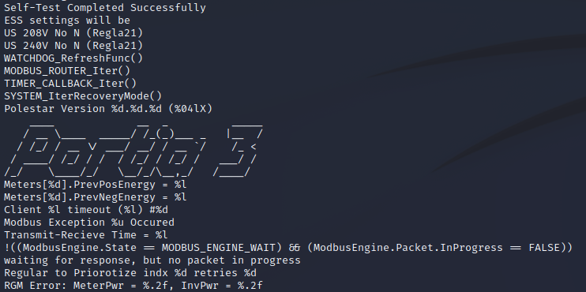
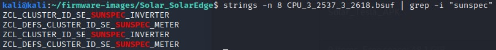
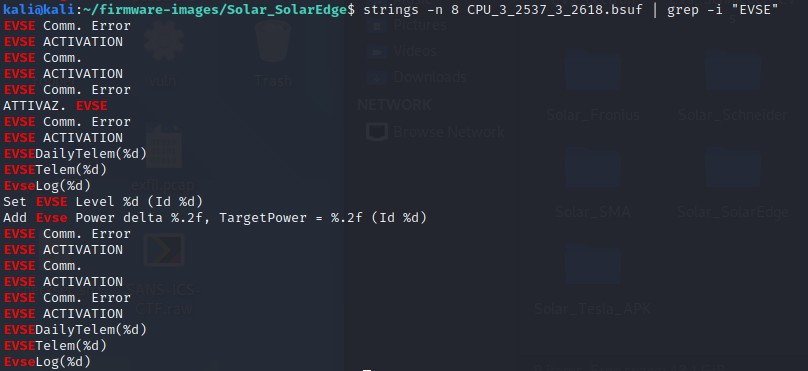
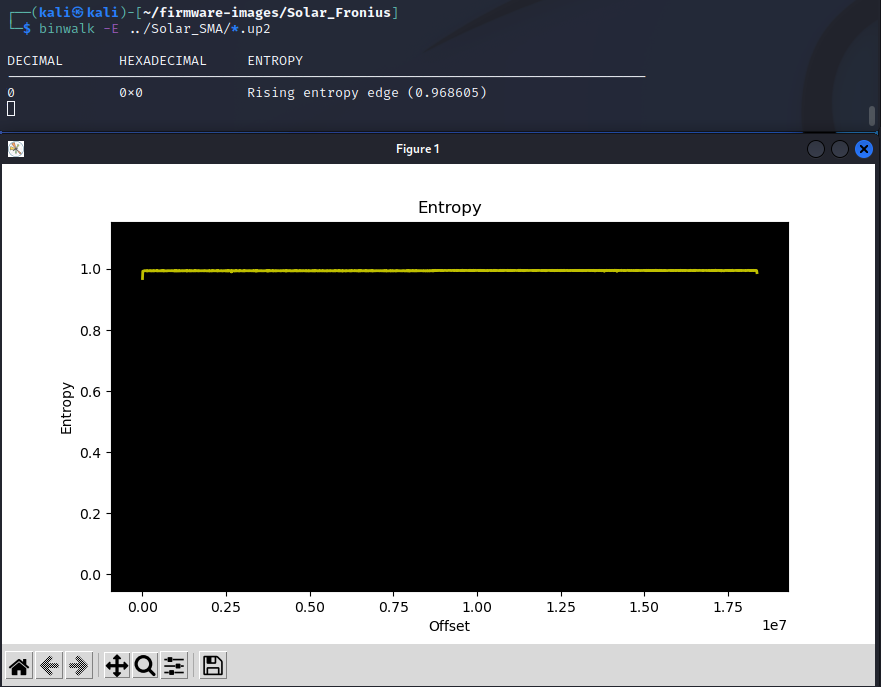
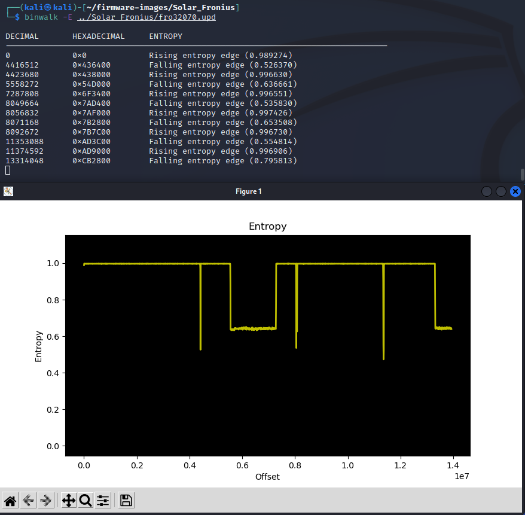

## Investigating DER Firmware

1. Navigate to the firmware directory.

    `cd ~/firmware-images`
	
	Show the directory contents:
	
	`ls`
	
	In this directory there are several software and firmware files for PV inverters and other devices. You can download these files from the vendor (typically) directly from their website. As an example, here is the firmware location for SolarEdge: [SolarEdge](https://www.solaredge.com/us/service/firmware).

2. Let’s see if the data is encrypted by dumping the first 20 lines of the file to the 
screen using the ‘head’ command.

	`cd Solar_SolarEdge`
	
	`ls`
	
	`head -n 20 CPU_3_2537_3_2618.bsuf`

    

3. Clearly this file is human-readable and not encrypted. What sort of information can we learn about the product from the firmware image? Let’s look at printable strings in file with a length of 20 characters or more:

    `strings -n 20 CPU_3_2537_3_2618.bsuf`
    

	Scroll through the data to identify some interesting power parameters and strings associated with “Modbus”, “Wireless”, “Portia3” (the name of their Linux distribution), etc.
	
	
	
4. Let’s find if there are any hard-coded websites using grep to match certain characters 
in the output:   

	`strings -n 20 CPU_3_2537_3_2618.bsuf | grep "\.com"`
    

5. Let’s find if this device uses Modbus, RS-485 serial communications, wireless, etc.   

	`strings -n 8 CPU_3_2537_3_2618.bsuf | grep -i "wireless"`
	
	`strings -n 8 CPU_3_2537_3_2618.bsuf | grep -i "RS485"`
 
	`strings -n 8 CPU_3_2537_3_2618.bsuf | grep -i "sunspec"`

    

6. Searching for the firmware extension may give hints to where it is stored on the device and the mechanics of the updated.

    `strings -n 8 CPU_3_2537_3_2618.bsuf | grep -i "bsuf"`
    

7. Let’s see if there’s anything about the EV Chargers in this firmware update.   

	`strings -n 8 CPU_3_2537_3_2618.bsuf | grep -i "Charger"`
	
	`strings -n 8 CPU_3_2537_3_2618.bsuf | grep -i "EVSE"`
    
    

8. Think about what an adversary could do with this information. Is it possible to modify this firmware to make the equipment not work, change the hard-coded websites, or modify the scaling on the power parameters? It is likely that this would be difficult because there are Cyclic redundancy check (CRC) codes and/or hashes that would need to be aligned with the firmware changes.  These are often located at the end of the file. Let's print the last 5 lines of the firmware. 

	`tail -n 5 CPU_3_2537_3_2618.bsuf`

	
	
	It is possible there is a CRC code there, but it is difficult to know.  It's not obvious from the hex data either. 
	
	`tail -n 5 CPU_3_2537_3_2618.bsuf | hexdump -C`

## Investigating Solar Firmware

1. Navigate to the **Fronius** firmware directory using the filesystem browser in the Kali VM:

    `cd ~/firmware-images/Solar_Fronius/`
	
	`head fro32070.upd`

2. Let’s look around for human-readable content.

    `strings -n 10 fro32070.upd`
	
	Now look to see what versions of the Symo product exist in this firmware image:
	
	`strings fro32070.upd | grep Symo`
	
	Is there any reference to the California Electric Rule 21 grid code?
	
	`strings fro32070.upd | grep Rule21`
	
	These are likely the different modes of operation for this firmware with different voltage levels, with and without a neutral connection. 
    
3. Not all firmware is human-readable. Some companies will compress, encrypt, or otherwise obfuscate their firmware images to reduce the ability of an adversary to modify the software. For instance, let's look at the **SMA** firmware. There’s little that is human-readable except the version number.

    `strings -n 10 ../Solar_SMA/SB5.5-LV-JP-41-1.02.06.R.up2 | less`

	(Use `space` to scroll through the content and `q` to exit)

4. We can look at the binary data and see that it’s mostly gibberish. 

    `hexdump -C ../Solar_SMA/*.up2 | head -n 50`
 
	To confirm, we can perform an entropy analysis on the data:
 
	`binwalk -E ../Solar_SMA/*.up2`
    
	The entropy will be high (close to 1) when the bytes in the image look random, and that could mean the image has an encrypted, compressed, or otherwise obfuscated file.
	
	
	(Close the image with the `x` in the upper right after inspecting it.)

5. Compare that to the Fronius data with portions of human readable data (entropy is less than 1 for large portions of the file).

    `binwalk -E ../Solar_Fronius/fro32070.upd`
	
	
	(Close the image with the `x` in the upper right after inspecting it.)
    
6. Look at the **Schneider Electric XW+** firmware. There is nothing human-readable but there are portions of the data that have lower entropy, indicating the file is not encrypted. Instead it may be compressed in some way.

	`cd ~/firmware-images/Solar_Schneider/conext-xw-6848-120240v-firmware-version-2-07-bn-4/Conext\ XW+\ 6848\ 120-240V/`

    `head 865-6848-01.02_07_00.BN0004.xf0`
	
	`strings -n 10 865-6848-01.02_07_00.BN0004.xf0`
	
	`binwalk -E 865-6848-01.02_07_00.BN0004.xf0`
    
	
	
##Lessons Learned

Open-source tools are available to open, examine, and pull relevant information out of a variety of firmware files. Using these tools, an adversary can better understand the environment in which they are interacting, and potentially manipulate firmware to impact the devices.

Operators can use the techniques from this lab to investigate if firmware is encrypted or contains human-readable content that could expose operating system, programs, open ports/services, authors, software programs used on the devices, and more. 

DER vendors should consider encrypting their firmware images to minimize the likelihood of adversaries gaining more information about their operating environment. 
