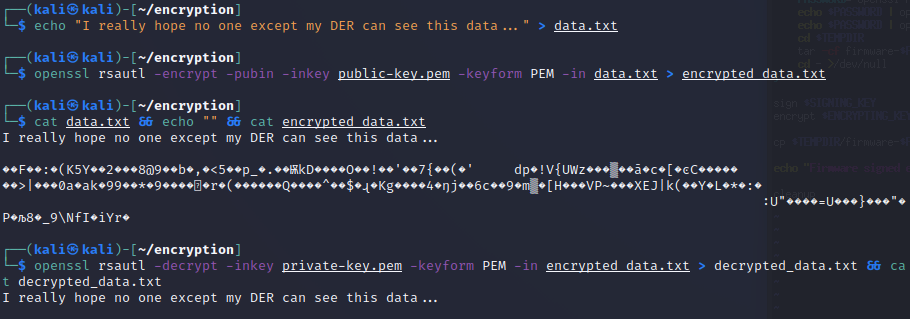
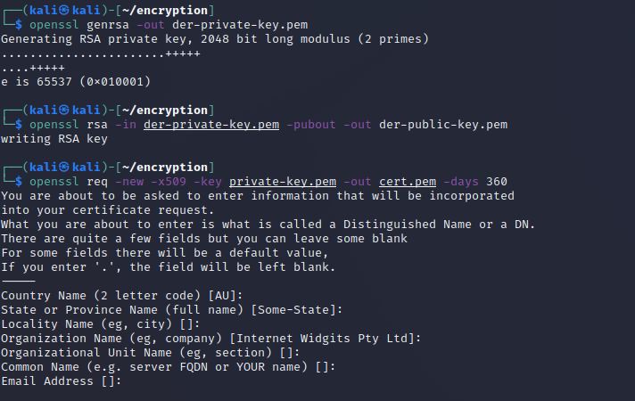
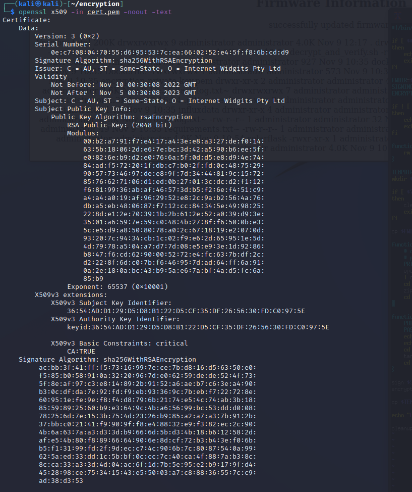
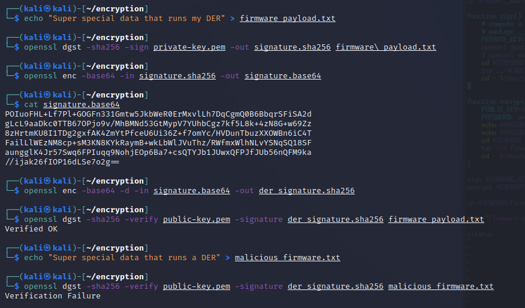

### Big Picture

This optional exercise discusses the elements used to encypt and sign the firmware update in the previous exercise.  To do this, we will be using 3 cryptographic operations:

1. Symmetric encyption/decryption of a file using AES.
2. Asymmetric encryption/decryption of a secret (e.g., a symmetric key/passphrase) using RSA.
3. Digital signatures using asymmetric encryption to validate the authenticity of the firmware.

### Symmetric Encryption/Decryption of a File
Symmetric cryptography uses the same key (shared secret) for the encryption and decryption. In this case, we use a passphrase, `derpassword`, to encrypt and decrypt a file.

*Note* In order to make this lab easier, you may run all the commands below using a script ```~/lab3_encrypt_decrypt``` in the home directory of the Kali Linux machine by running: ```./lab3_encrypt_decrypt``` after opening a new terminal.

1. In the Kali VM, open a terminal window by clicking on the black `$_` icon on the favorites bar.

2. Once you have a terminal up, enter the following commands to change to the `encryption` directory and verify you have `openssl`.

	`cd encryption`

	`openssl version -a`

3. Create a plain text file that we want to encrypt:

	`echo 'This is DER firmware code that needs to be uploaded' > plain.txt`

4. Create the encrypted file using an Advanced Encryption Standard (AES) with a 256-bit key:

	`echo "derpassword" | openssl aes-256-cbc -pbkdf2 -in plain.txt -out cipher.txt -pass stdin`

	where:

	* `-aes-256-cbc` selects a 256-bit AES symmetric cipher
	* `-pbkdf2` uses the PBKDF2 (Password-Based Key Derivation Function 2) algorithm
	* `-in` is the file to encrypt
	* `-out` is the encrypted output file
	* `echo "derpassword"` and `-pass stdin` enter the `derpassword` for the user
	* adding `-d` will decrypt the file

5. Take a look at the encoded encoded file:

	`cat cipher.txt`

	Notice it is unreadable.

6. Now let's decrypt the file and display the contents:

	`echo "derpassword" | openssl aes-256-cbc -d -pbkdf2 -in cipher.txt -out decrypted.txt -pass stdin`

	`cat decrypted.txt`


### Asymmetric Encryption and Decryption
Asymmetric cryptography uses a public and private key pair to encrypt and decrypt data.  Typically, the public key of the recipient is used for encryption and the private key of the recipient is used for the decryption. The public key cannot be used to decrypt the data.

Now let’s see how we can encrypt and decrypt a file. Providing this confidentiality requires the public key to encrypt the data and the private key decrypt the data.  For firmware updates, the DER will have the private key (possibly installed or generated during manufacture or commissioning) and the manufacturer will have a public key.

1. First generate a private key that will be on the DER.

	`openssl genrsa -out private-key.pem`

	Look at the private key: 
	
	`cat private-key.pem`

2. Generate corresponding public key and save this at the DER manufacturer.

	`openssl rsa -in private-key.pem -pubout -out public-key.pem`

	Look at the public key: `cat public-key.pem`

	

3. Create a special message to encrypt.

	`echo "I really hope no one except my DER can see this data..." > data.txt`

3. Use the **public key** at the manufacturer to encrypt the message.  

    `openssl rsautl -encrypt -pubin -inkey public-key.pem -keyform PEM -in data.txt > encrypted_data.txt`

3. Look at the plain text and encrypted data (they don't match!):   

    `cat data.txt && echo "" && cat encrypted_data.txt`

4. Use the **private key** to decrypt and display the data:   

    `openssl rsautl -decrypt -inkey private-key.pem -keyform PEM -in encrypted_data.txt > decrypted_data.txt && cat decrypted_data.txt`

	What do you know, it worked!



### Digitial Signatures
The code signing process uses asymmetric cryptography to verify the integrity of data and authenticity of the source. The process is shown in the figure below.


Let's walk through this process.

1. Generate a new public-private key pair.

    `openssl genrsa -out der-private-key.pem`

	`openssl rsa -in der-private-key.pem -pubout -out der-public-key.pem`

2. Store the **private key** with the software development team. Place the **public key** on the DER to prove the update is legitimate.

3. Create a self-signed certificate using the private key. (Note: a better practice is to have the certificate signed by and “chained to” a certificate authority, using a certificate signing request. This ensures the private key used for signing is associated with the company writing the code.)   

	`openssl req -new -x509 -key private-key.pem -out cert.pem -days 360`

	Press enter through all the information.

	

4. View the certificate.

	`openssl x509 -in cert.pem -noout -text`

	

5. Create a DER software update.

    `echo "Super special data that runs my DER" > firmware_payload.txt`

6. Create a binary digest and digital signature of the file.  This ties the `signature.sha256` file to the private key that exists with the software development team.

    `openssl dgst -sha256 -sign private-key.pem -out signature.sha256 firmware\_payload.txt`

7. Convert digital signature to Base 64 to compress the data and make it easier to transfer.   

    `openssl enc -base64 -in signature.sha256 -out signature.base64`

	`cat signature.base64`

8. At this point, the manufacturer would send/upload the firmware and signature to the DER.  The following actions would automatically happen on the DER equipment to validate the integrity and authenticity of the firmware update.

9. Convert the signature from Base 64 back to binary.

	`openssl enc -base64 -d -in signature.base64 -out der_signature.sha256`

10. Verify a digital signature using the OpenSSL `digest` function and the public key previously installed on the DER.  

    `openssl dgst -sha256 -verify public-key.pem -signature der_signature.sha256 firmware_payload.txt`

11. Notice `Verified OK` result confirms the `firmware_payload.txt` file is from the manufacturer and has not been manipulated in transit.  This is done by taking the SHA256 hash of the `firmware_payload.txt` and comparing that to the hash in `der_signature.sha256`.

12. Let’s prove someone cannot change the code.   

    `echo "Super special data that runs a DER" > malicious_firmware.txt`

    `openssl dgst -sha256 -verify public-key.pem -signature der_signature.sha256 malicious_firmware.txt`

13. Notice the result is Verification Failure.

	

### More On Encryption (Optional)

Extra Credit for Solar: It is worth noting that RSA is not the only asymmetric cryptosystem. IEEE 2030.5 uses the following cipher suite: `TLS_ECDHE_ECDSA_WITH_AES_128_CCM_8`. Breaking this down:

* __TLS__: Transport Layer Security 1.2 is specified. TLS is the encryption used in web browsing for secure banking, credit card transactions, etc. Notably, the IEEE 2030.5 cipher suite complies with the RFC for TLS version 1.3.
* __ECDHE__: The key exchange algorithm is Elliptic Curve Cryptography (ECC) with the P256 (also known as secp256r1 or prime256v1) curve using the Diffie-Hellman (DH) key agreement algorithm with Ephemeral (E) keys. The use of ephemeral keys provides for Perfect Forward Secrecy.
* __ECDSA__: The signature algorithm is the Elliptic Curve Digital Signature Algorithm
* __AES_128__: The bulk (symmetric) traffic encryption algorithm is the Advanced Encryption Standard (AES) using 128-bit keys. 128-bits complies with NSA Suite B requirements at the secret level. AES is run in Counter mode with Cipher Block Chaining (CBC).
* __CCM_8__: Counter mode with CBC-MAC (CCM) is an Authenticated Encryption with Additional Data (AEAD) algorithm that combines encryption and authentication in one process, utilizing the final block of ciphertext as the Message Authentication Code (MAC)

Additional information on firmware code signing and digital signatures is in:

* J. Johnson, I. Hanke, “Recommendations for Distributed Energy Resource Patching,” Sandia Report
SAND2021-11150, September 2021.

More information on DER cryptography is in:

* J. Obert, P. Cordeiro, J. Johnson, G. Lum, T. Tansy, M. Pala, R. Ih, “Recommendations for Trust and
Encryption in DER Interoperability Standards,” Sandia Technical Report, SAND2019-1490, Feb 2019.
* C. Lai, N. Jacobs, S. Hossain-McKenzie, C. Carter, P. Cordeiro, I. Onunkwo, J. Johnson, "Cyber Security
Primer for DER Vendors, Aggregators, and Grid Operators," Sandia Technical Report, SAND2017-13113,
Dec 2017.
