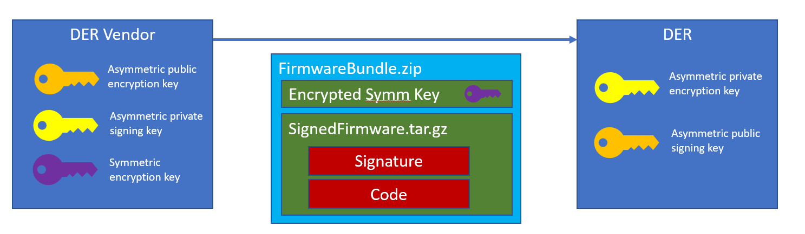
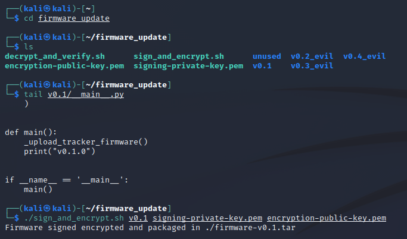
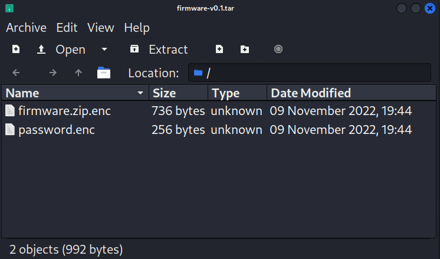
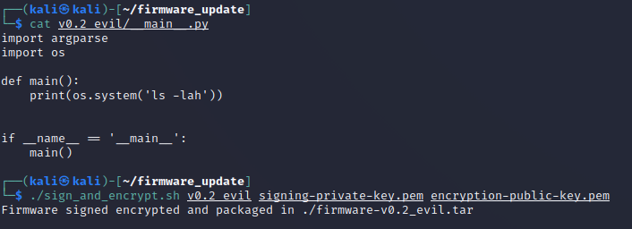

# Securely or Insecurely Updating Device Firmware

In the prior lab we found that DER firmware is often not encrypted.  The firmware is also rarely digitally signed for authenticity.  We are now going to create encrypted firmware images with digital signatures to perform a firmware update on the DER device to show how this could be done.  The details of this process will be transparent to you, but if you are interested in how it works, you can review the following section.  The next lab will demonstrate the components that are used with this DER device. 

### Firmware Update Process
The DER equipment has been designed to accept a very specific file format that can be decrypted and validated in the field with pre-installed keys.

Unfortunately, asymmetric encryption is not appropriate for encrypting large data files like firmware packages.  Therefore vendors often use asymmetric keys to encrypt a symmetric key that can then be used to decrypt the data package. With this in mind, the final firmware update mechanism uses the following sequences: 

* At the DER vendor:

	1. Create, test, and validate the firmware data. 
	2. Create digital signature using vendor `private signing key`. 
	3. Compress the firmware data and the digital signature in a single file. 
	4. Generate random `symmetric encryption key` and encrypt compressed file. 
	5. Encrypt the symmetric key with the `public encyption key` of the DER.
	6. Compress the encrypted file and the encrypted key to create a final firmware file. 
	
* The DER equipment will reverse this process:

	1. Decompress the file to get the encrypted symmetric key and encypted firmware file.
	2. Decrypt the symmetric key using the `private encryption key` that is preinstalled on the DER.
	3. Use the `symmetric encryption key` to decrypt the compressed file with firmware and signature. 
	4. Decompress the file and compare the signature digest using the `public signing key` with the hash of the firmware file. 
	5. If the signature verification passes, the software has not been corrupted/modified and can be installed. 

The keys and firmware file format are represented below: 

### Updating DER Firmware

1. On the Kali Machine, there are keys that can be used to sign and encrypt firmware for the DER.  First navigate to the `firmware_update` directory and look at the contents.  

	`cd ~/firmware_update`
	
	`ls`
	
	You will notice there is a `encryption-public-key.pem` and a `signing-private-key.pem`.
	
2. Look at the python package that we want to send to the DER. This will be executed when we upload it. 

	`cat v0.1/__main__.py`

	It is a python code that uploads solar tracker firmware to the Arduino UNO to have the tracker follow a light source using the photodiodes. Then the code prints the version number, `v0.1.0`, to the website. 
	
3. Sign the firmware using the `sign_and_encrypt.sh` bash script.  Feel free to look at the details of the code if you are interested. 

	`./sign_and_encrypt.sh v0.1 signing-private-key.pem encryption-public-key.pem`
	
	
	
	If you look in this compressed tar file you will find the asymetrically-encrypted symmetric password (`password.enc`) and the encrypted, compressed file (`firmware.zip.enc`) containing the firmware file and a base 64 encoded digital signature file: 
	
	
	
4. In the firefox browser on the Kali machine, navigate to the firmware upload page at `http://10.10.0.100/firmware/update`

5. Click the `Browse` button and select the `kali/firmware_update/firmware-v0.1.tar` file. Click `Upload`. You should be presented with the following screen. 

	

6. The DER validated the firmware update using the `encryption-private-key.pem` and `signing-public-key.pem` files that are on the DER device. Use your smart phone or some other light source to test the tracker.  The solar tracker should follow the light source. 

7. But what would happen if there was an insider threat or someone else gained access to the DER manufacturer's signing keys?  Could they write malicious code to cause the DER device to divulge private information or stop working.  Let's try this.  First look at the changes in Firmware `v0.2_evil` and then sign this code. 

	`cat v0.2_evil/__main__.py`
	
	Here we're requesting the DER to no longer print the version number, but the contents of the working directory. 
	
	`./sign_and_encrypt.sh v0.2_evil signing-private-key.pem encryption-public-key.pem`
	
	
	
8. Repeat the upload process, but select the `firmware-v0.2_evil.tar` file.  Now we can see the files that are running on the webserver!

	

9. We see that this directory includes the `encryption-private-key.pem`.  We could also print this to the website for anyone to steal by modifying the code in the `__main__.py` file.  Sign the `v0.3_evil` code and upload it to see this key.

	`./sign_and_encrypt.sh v0.3_evil signing-private-key.pem encryption-public-key.pem`
	
	

10. Now, let's compromise the operations of the solar tracker by uploading code that will cause the tracker to **avoid** light sources. There is malicious code included in `v0.4_evil` that reverses the tracking logic. Sign the code and then upload it to the website. 

	`./sign_and_encrypt.sh v0.4_evil signing-private-key.pem encryption-public-key.pem`
	
	You should see the website report the version `v0.1.0 Evil Tracker`. Use your smart phone or some other light source to see how the tracker operates now.  It should avoid the light source. 
	
11. Let's set the tracker firmware back to the good version.  Please upload the `kali/firmware_update/firmware-v0.1.tar` file once again. 

## Takeaways

Clearly, losing the signing keys or allowing access to the signing server is catastrophic.  With this access any malicious firmware can be uploaded to all the devices which could break or otherwise damage the DER equipment. For example, in the 2015 Ukraine attacks, the adversary uploaded malicious firmware to brick devices.

