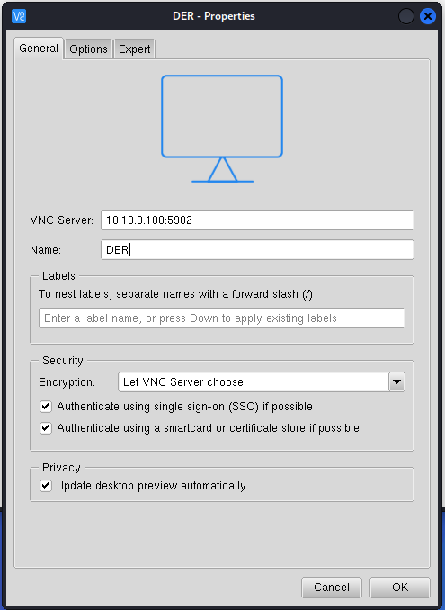
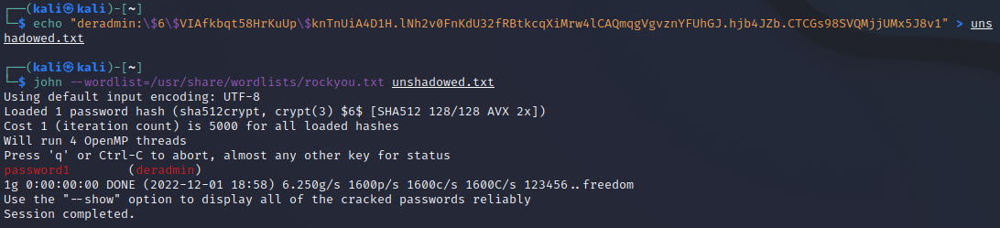

# Controlling the DER through VNC
	
1. Use the Kali icon to search for VNC Viewer and open the application.
 
2. To connect to the HMI, you will use the IP address you discovered via Nmap with the username and password combination for the system. 

	Enter `10.10.0.100:5900` in the VNC Server field at the top. You can also give this connection a name like `DER`. Click **OK**. And start the session by right clicking on the icon and selecting **Connect**. 
	
	

3. Enter the credentials that we learned from the website vulnerability.  Enter `vnc` as the user and `superman` as the password. 

	
	NOTE: this VNC version requires a user of `vnc` to be entered. 

3. Click on the image to enter the VNC session. This is an unencrypted way of interacting with systems.  

	If prompted for a username/password, select `vnc` from the dropdown and enter `superman` as the password.

	

	**NOTE**: Please restart the DER device if the VNC service is not working or is not letting you into the system. 

4. Once you’re logged in you can see the operating system of the DER simulator.  Many DER devices don’t include GUIs, but this one does.  **DON’T INTERACT WITH ANY OF THE RUNNING CODE PLEASE**. Please open a new terminal by clicking on the 3x3 dot icon at the bottom and selecting `Terminal`.  

4. We can dump the hashed passwords of the der users from the `/etc/shadow` file using the following commands: 

	`bash`
	
	`sudo cat /etc/shadow | grep der`
	
	We see the following:
	`deradmin:$6$VIAfkbqt58HrKuUp$knTnUiA4D1H.lNh2v0FnKdU32fRBtkcqXiMrw4lCAQmqgVgvznYFUhGJ.hjb4JZb.CTCGs98SVQMjjUMx5J8v1:19069:0:99999:7:::`

	The $6$ indicates that hash is SHA-512 with many rounds, the 2nd block of code `VIAfkbqt58HrKuUp` in this case is a base64-encoded salt that is added to the password before hashing to ensure the hash is unique.  The next chuck of code (`knTnUiA4D1H.lNh2v0FnKdU32fRBtkcqXiMrw4lCAQmqgVgvznYFUhGJ.hjb4JZb.CTCGs98SVQMjjUMx5J8v1`) is the hash of the password. 

	

5. We’re interested in knowing the password for **deradmin** because it could be reused for cloud environments or other places.  We can crack this password using several tools including John the Ripper. 

6. Close the VNC connection to the DER by exiting out of the VNC View Application. 

## Password Cracking with John 

1. John the Ripper is software used to crack password hashes. Take a look at all the options with the following **Kali** terminal command: 

	`john --help`
	
2. John requires hash files of a particular format, which can be generated using the following:

	`echo "deradmin:\$6\$VIAfkbqt58HrKuUp\$knTnUiA4D1H.lNh2v0FnKdU32fRBtkcqXiMrw4lCAQmqgVgvznYFUhGJ.hjb4JZb.CTCGs98SVQMjjUMx5J8v1" > unshadowed.txt`

3. Then the password can be determined with this dictionary search.

	`john --wordlist=/usr/share/wordlists/rockyou.txt unshadowed.txt`

	We can see that deradmin has the password `password1` and this could potentially be used to pivot to other portions of the network.  

	
	
	Note: if you would like to recrack the password, run `rm ~/.john/john.pot` to remove the cracked password file. 

## Lab 5 – Lessons Learned
This lab looked at exploiting different web interfaces and using information gained from remote access to further exploit the environment. We saw how SQL and code injection attacks can extract data from the server system.  We also saw how VNC connections to the equipment could be used to get additional sensitive information from the DER. These techniques are often used to elevate priviledges for the attacker.  Lastly, we saw how a password hash could be cracked to expose the user's plaintext password. 
