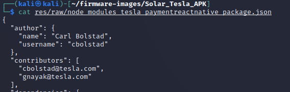
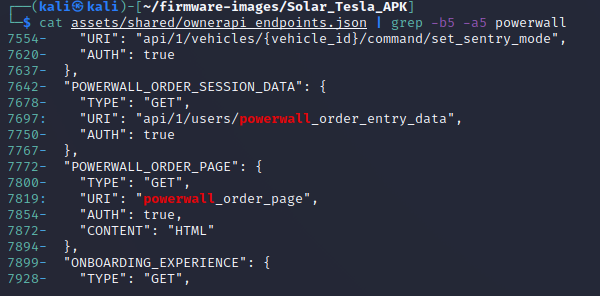

## Tesla App Inspection

1. Let’s look at the ChargePoint APK. An .apk file is really a zipped file. We can unzip this data:

    `cd ~/firmware-images/Solar_Tesla_APK/` (go to Tesla app directory)
	
	`file com.teslamotors.tesla_4.6.0-885-885.apk` (determine file type)
	
	`unzip com.teslamotors.tesla_4.6.0-885-885.apk` (decompress the file)
	
	`ls` (list directory contents)
	
	
    
2. Let’s search for Tesla email addresses:

    `grep -r "tesla\.com"` 
	
	`cat res/raw/node_modules_tesla_paymentreactnative_package.json`
	
	
	
	The risk of including names and email addresses in apps is that these people may be targeted for spearphishing or other campaigns.  Carl could also be targetted by competitors for industrial sabatoge or talent poaching.  
	
	`grep -r "teslamotors\.com"`
    
	This seems to show payment API endpoints that could be targetted by adversaries. 

3. Looking at that JSON file more closely, we can see the software versions being used by the app. If there are known vulnerabilities for this software, this would be useful data for the attackers.

    `cat res/raw/node_modules_tesla_paymentreactnative_package.json`
    
	
	
4. There don’t appear to be any passwords or certificates, but there is indications of solarcity and powerwall that lead to a file with API endpoints.

    `grep -r -I "password"`
	
	`grep -r -i "certificate"`
	
	`grep -r -i "solarcity"`
	
	`grep -r -i "powerwall"`

	`head -n 200 assets/shared/ownerapi_endpoints.json`
	
	These API endpoints are mostly for Tesla vehicles, but there are a few for the Powerwall stationary energy storage systems: 
	
	`cat assets/shared/ownerapi_endpoints.json | grep -b5 -a5 powerwall`
	
	

5. What open-source code from github is running on the app?

    `grep -r -i "github"`
    
	As an example, it looks like they use ez-vcard (https://github.com/mangstadt/ez-vcard) which is a vCard library written in Java. vCards or Virtual Contact Files are a file and data interchange format used in business cards, smartphone contacts, and other applications.  If it is found that this software includes a serious bug, it may be possible to compromise the smart phone or DER/EVSE device running this software. 

6. Some of the operational code is in three Dalvik EXecutable (DEX) files - a process virtual machine
(VM) for the Android operating system.
	
	`file *.dex`
    
	Run the GUI version of JADX, an open-source Dex to Java decompiler, to convert Dalvik bytecode to java classes. 
	
    `../jadx/build/jadx/bin/jadx-gui`

	Using the shift key, you can select all the `.dex` files. 
	
	
	
7.  We can see several things in these files. 

	* `com.teslamotors.TeslaApp.MainActivity` establishes an Android App session with hooks to the operating system and user interface, i.e., using Software Mansion's [Gesture Handler](https://docs.swmansion.com/react-native-gesture-handler/docs/). 
	* `com.auth0.android.jwt.JWTDeserializer.deserialize` likely shows the fields that Tesla is using for their JSON Web Token (JWT) used to interact with the server API. 
	* `com.teslamotors.plugins.ble.TeslaCardEmulationService` is used to create a Bluetooth Low Energy (BLE) signal to emulate a Tesla Card. 
	* `com.tesla.data.oapi` includes the code for the Owner API. 
	* `f.b.c.a.a.a.a.c` include cryptographic functions for the application. 
	* Plus lots more. Dig around and see what you can find!

# Lessons Learned

Smart phone apps include a plethera of useful data for adversaries.  Some of the data includes open-source code resources, API endpoints, hard-coded credentials or certificates, names and/or email addresses of software developers, etc.  As one example, cybersecurity researchers were able to bypass the JWT (JSON Web Token) authentication for some API endpoints on Hyundai vehicles to [control the locks, horn, headlights, and truck](https://threadreaderapp.com/thread/1597695281881296897.html) of the vehicle by monitoring the traffic from a mobile app. When building these applications, all sensative data must be removed and the authentication mechanisms made bulletproof. 