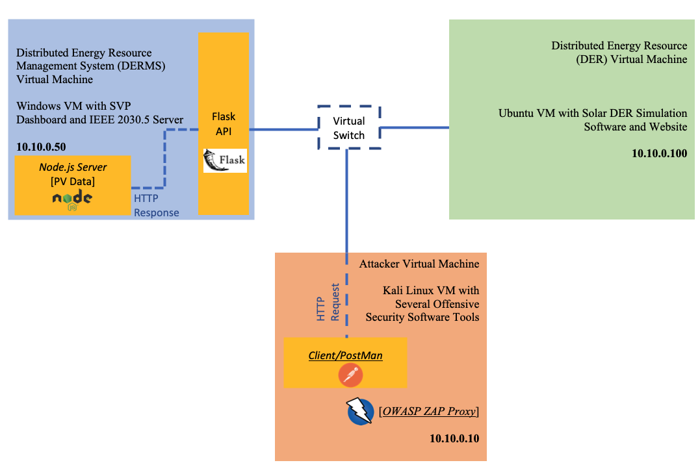
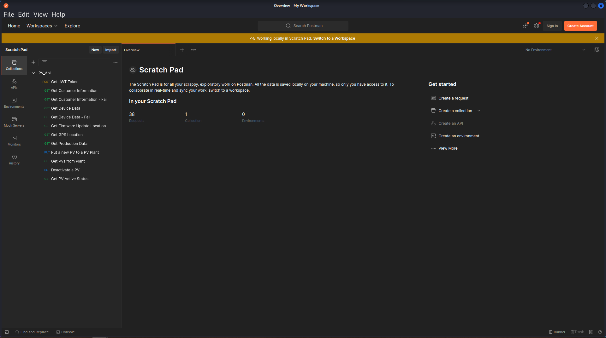
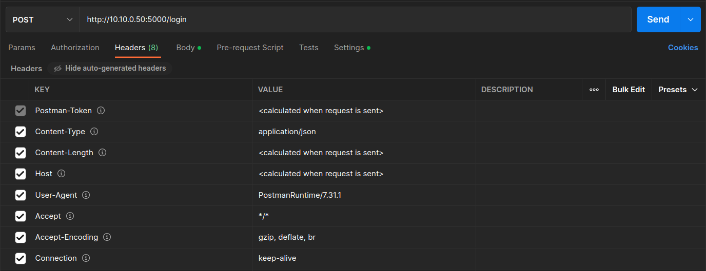
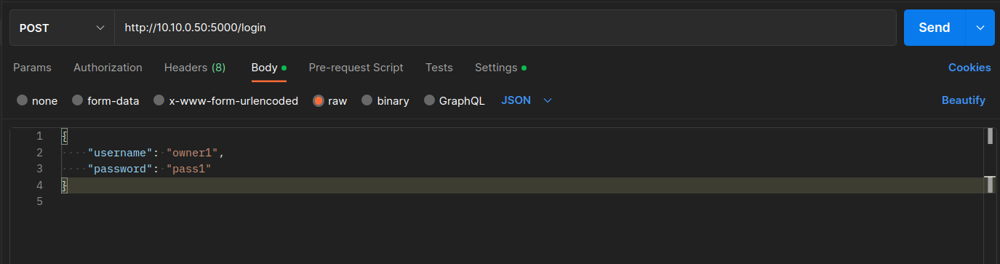
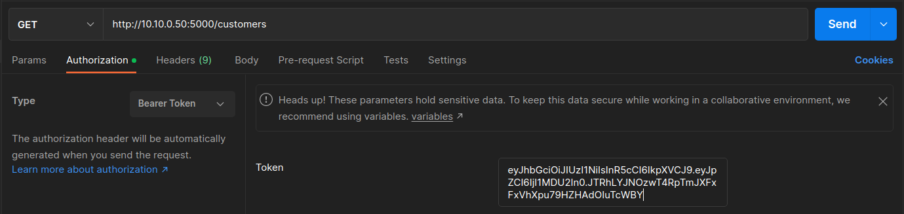
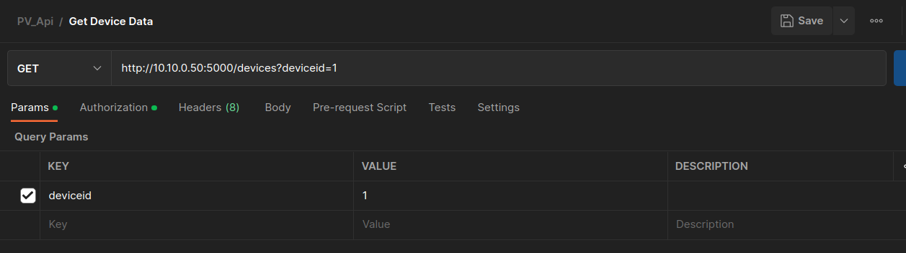
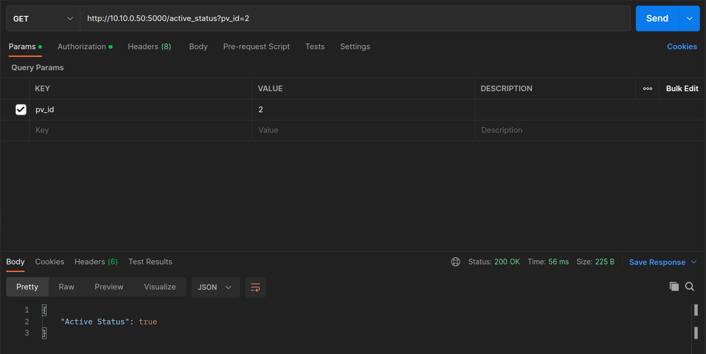
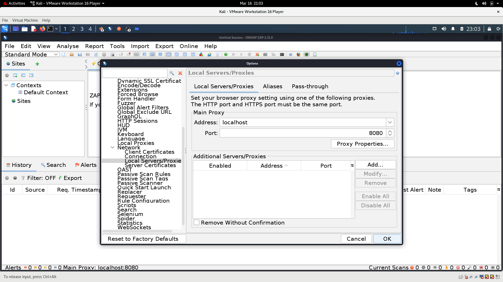
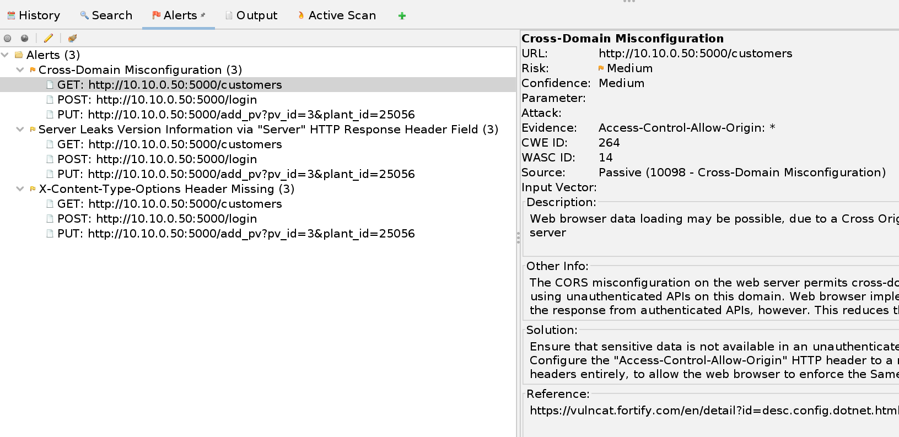

# Background

Application Programming Interfaces (APIs) are widely used by organizations to control cars, EV chargers, DER equipment, and other machines.  The API websites use a set of standardized HTTP methods. These methods are things like:

* **POST** - submits an entity to the specified resource
* **GET** - request a representation of the specified resource
* **PUT** - replaces all current representations of the target resource 
* **PATCH** - applies partial modifications to a resource
* **DELETE** - deletes the specified resource

Smart phone apps or field devices communicate with cloud API endpoints (resources) through these HTTP methods.  An example resource might be `http://dercompany.com/customers/customer_id/12345/power_production`. A GET request on this resource would return power production from customer 12345's DER device.  This is one way that apps can display live DER power levels.  Unfortunately, there have been several authentication and authorization vulnerabilities discovered with APIs that allow adversaries to access data or control equipment they do not own.  We will explore these issues in this lab.  In the next exercise, we will find API endpoints in DER smart phone apps. 

## Scenario & Architecture
You are an attacker (i.e., a Client/Postman on the Kali Linux VM) who needs to access the DER Vendor’s information in the Windows VM through the DER Flask API. To do this, you must first be authenticated by the Server and once authenticated you can interact with the DER Flask API by performing various HTTP requests. Specifically, the requests that will be examined in this lab are the following:

1. Login & Retrieve the JWT token (POST request)
2. Retrieve PV customer information (GET request)
3. Retrieve PV inverter’s data (GET request)
4. Get Firmware Update for a PV inverted (GET request)
5. Get the GPS location of a PV inverter (GET request)
6. Get the production data of a PV inverter (GET request)
7. Add a new PV inverter to a PV plant (PUT request)
8. Get the PV inverters that belong to a PV plant (GET request)
9. Deactivate a PV inverter (PUT request)
10. Get the status of a PV inverter (GET request)



Finally, to identify potential cybersecurity vulnerabilities of the DER Flask API you will also utilize OWASP (Open Web Application Security Project) ZAP (Zed Attack Proxy) for automated penetration testing in the Kali Linux VM. 

Note: This API was designed to have similar behaviors as the [SMA APIs](https://developer.sma.de/sma-apis.html).

## Interacting with the API

1. On the Windows DERMS machine, open two Windows PowerShell from the taskbar. Right click the icon and select `Windows PowerShell` to start a 2nd instance.  In one, enter the following: 

	`node .\Documents\cyberstrike_api\pv_server.js`

	In the other, enter the following:

	`python .\Documents\cyberstrike_api\pv_api.py`

	This will start the the Node.js Server which stores the PV Data and DER Flask API. The Node.js server listens on port 3000. The DER Flask API is listening to port 5000.
	
	

3. On the Kali Linux machine open a new terminal window and use the following command to start Postman:

	`Postman`
	
	

4. In the Postman application, there are a collection of preprogrammed POST, GET, and PUT requests in the left pane. 

	  	

5.  When we click in the first POST request, i.e., **Get JWT Token** , we can see the URL of the request which is:

	`http://10.10.0.50:5000/login`

	When you click in the **Headers** tab you are able to see all the headers that are used to send this POST request. For example, you can see that we specify the `Content-Type` header to be `application/json` indicating that the request body format is JSON. Another example is the `Content` header which is specified as `keep-alive` maintaining a connection between the Postman client and the Node.js server, reducing the time needed to serve the HTTP requests.
	
	If you click in the **Body** tab you will be able to see the Request body of the Get JWT token request, which is actually defined as a JSON (remember the Content-Type header) and contains the username and password of the user who needs to be authenticated in the system.
	
	
	
	

5. Click **Send** to send the POST request to the API for authentication. After the request is sent you can see in the Response Body the `JWT_token` which will be used as an authentication header to send successfully subsequent HTTP requests.

	The JWT can be decoded into human-readable content through several tools.  In this case, the payload is simply the id of the user, as shown below. 

	
	
	
	
6.  Now click the second GET request, ** Get Customer Information **. The URL of the request which is `http://10.10.0.50/customers`. Postman has been prepopulated with the JWT for most of the remaining requests. 

	Click the **Authorization** tab and you will see the *Bearer Token* that was returned from the server. 

	Click **Send**.  The GET request to the API will check the JWT token return all the customer information. 

	
	
	

7. Let's now check the third HTTP request, i.e., ** Get Customer Information - Fail **. This request is the same with the previous one, but without the JWT authorization token.
   
	Click **Send**. You will see a Response body from the Server: `{"Auth_Message": "Authorization header missing"}` and a 401 HTTP status code (UNAUTHORIZED)  
   
	

8. Now let's issue the **Get Device Data** GET request. In the request body we can put a *deviceid* as a value for any PV inverters we want, e.g., *1*, *2*, or *3*.

	For the user to fetch the PV information, they must be authenticated with a JWT. Confirm the authorization header uses a *Bearer Token* with the JWT from the *Get JWT Token* request.
	
	Press *Send*.  The response from the server will include PV information such as the battery capacity, firmware version, and others.
	
    
	
    

    

8. Change the PV id to *2* in the *params* tab. Send the request and observe the response. You should be able to see the information of PV inverter with id 2.

9. Now, let's try to see the information of PV Inverter ID 3.  We can see that the user with this specific JWT does ** NOT ** have access to see the information of this particular PV system, since we get a 401 UNAUTHORIZED error and a respective Auth_Message.  PV plant 25056 that includes PV Inverter IDs 1 and 2. It does ** NOT ** include PV Inverter ID 3.

	

10. Now let's send the **Get Firmware Update Location**. Based on the Inverter deviceid, the API informs the user of the firmware update file's URL, i.e., ``http://127.0.0.1/firmware_download_25056`.  

	

11. Next, send the HTTP GET **Get GPS Location** request, which returns the GPS location of the PV inverter. For deviceid=1, we can see that the returned coordinates for the first PV are *latitude=51.31555* and *longitude=9.4567*. 

	

12. Send the **Get Production Data** request to get the *deviceid* to get information on the battery, PV, and grid data.

	

13. The next HTTP request uses a ** PUT ** request, **Put new PV Inverter in PV Plant** to create a new resource in the server. When you open this request in Postman, you can see that you can specify two parameters in the request body of the PUT request, i.e., the PV id and the PV Plant id. Specify the *pv_id* as 3 and the *plant_id* as 25056 and send the PUT request. Since Plant 25056 belongs to the authorized user, the addition of the inverter is permitted.  Verify the result by issuing the **Get PV Inverters from Plant** request.  If you change the *plant_id* to 12345 if will fail. 

	

15. Now send the **Deactivate a PV Inverter** command with *pv_id* of 1.

	

16. Verify the status of the PV inverter with the **Get PV Active Status** request with *pv_id* = 1.  Then try with *pv_id* = 2. 

	

	

### Lessons Learned
This lesson showed how to interact with an API through a Postman client. A wide variety of different HTTP requests were examined. Additionally, configuring HTTP Requests, headers, and authorization tokens such as JWT via Postman proved to be user-friendly and good for API testing purposes.

## OWASP Zap

1. To begin, if they are not already running, run the following in two PowerShell consoles on the DERMS (Windows) machine:

	`node .\Documents\cyberstrike_api\pv_server.js`

	`python .\Documents\cyberstrike_api\pv_api.py`

2. On the Kali machine, if not already running, start `Postman`.  We will now route all the Postman data through the OWASP ZAP application using a local proxy. 

	Click on `File` > `settings`. Click `Proxy` tab and select `Use the system proxy`. Check `HTTP`.  Set `Proxy Server` to `127.0.0.1` and port to `8080`.

	

3. Close the settings window. 
4. Click the Kali symbol in the top left and search for `OWASP ZAP` and run it. Next click on `Tools`> `Options`. Scroll down to `Network` > `Local Servers/Proxies` and enter: 
	
	* Address: `localhost`
	* Port: `8080`. 
	
	Click OK.

	

4. Open a terminal and enter the following: 

	`export http_proxy="127.0.0.1:8080"`

5. Switch back to Postman and select the first script **Get JWT Token** and click Send. You should see the JWT_token at the bottom along with Status: 200 OK.

6. Click on the next script **Get Customer Information** and click send. You should once again be able to see 200 in Postman. 

7. Repeat for **Put new PV Inverter in PV Plant**; in this case you should see 201 CREATED.

8. Once you have run these three scripts on Postman and observed the correct behavior, switch back to OWASP ZAP. Right click on the directory ```http://10.10.0.50:5000``` in the directory tree, scroll to `Attack` and click `Active Scan...`. Make sure that both `Recurse` and `Show Advanced Options` are selected, and then click `Start Scan`. The scan should take a minute or two to run and it will produce a list of all the attempted attacks at the bottom as it runs. 

9. Go to the `Alerts` tab to see the potential vulnerabilities that exist with this API implementation.  In our case, OWASP ZAP notes: 

	* Cross-Domain Misconfiguration
	* Server Leaks Version Information
	* X-Content-Type_Options Header Missing

	In a production API environment, these issues with the implementation would need to be addressed. 
	
	

10. Reset the proxy by entering the following in the terminal: 

	`unset http_proxy`

### Lessons Learned
In this lesson we showed how OWASP Zap can be used to create a proxy in combination with a web browser and Postman in order to conduct attacks against a solar distributed energy resource management API whenever vulnerabilities exist. We looked at how to set up proxies in Firefox and in OWASP Zap, and how we can then observe all the traffic that passes through the proxy in OWASP, which can then be used to set up and run automatic attacks against a target machine.

LAB COMPLETE!
