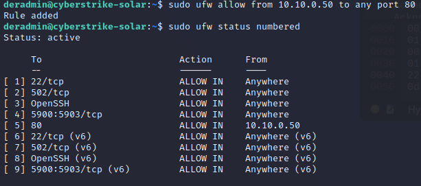
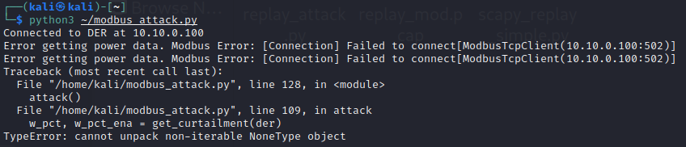

# IEEE 2030.5 

There are three standardized communication protocols identified in IEEE 1547-2018: SunSpec Modbus, IEEE 1815 (DNP3), and IEEE 2030.5.  DER equipment are required to have one of these interfaces so that grid operators and/or 3rd parties can interact with the devices. 

We have seen how the SunSpec Modbus protocol works.  It uses holding registers to read/write data to the DER device which is the Modbus Server.  In the case of IEEE 2030.5, the client and server are "reversed".  The DER is the client (like a Web Browser) which communicates to a IEEE 2030.5 server (like a website, e.g., google.com) to download information at a user-configured poll rate.  This information is encrypted using TLS 1.2 and includes nameplate, configuration, and monitoring information. The default poll rate for IEEE 2030.5 is 15 minutes, but our DER has this set to 10 seconds so the data exchange can studied more easily. By using a TLS connection the prior replay and MITM attacks are no longer possible. 

1. On the Windows machine, start Wireshark. Select **Ethernet1** as the interface to monitor. 

	NOTE: you can also get the packet capture on the Kali machine if you run ettercap (`sudo ettercap -T --iface eth1 -M ARP /10.10.0.50// ///`), but it's a little easier on the DERMS machine. 

2. Start the IEEE 2030.5 server by double clicking on the `run_2030.5_server.bat` icon on the Windows desktop. This will start a Python IEEE 2030.5 server on the DERMS.  **This server is copyrighted software and licensed to CyberStrike for educational purposes only. Please respect this license.**

3. After 30 seconds, if you do not see regular traffic in the server screen, please restart the DER simulator device or VM.  Traffic to the simulator should look like the following: 

	```
	10.10.0.100 - - [29/Nov/2022 09:19:10] "GET /dev/683475070343/dc?s=0&l=10 HTTP/1.1" 200 1782
	{'time': 1669738750.8825955, 'type': 'req', 'method': 'GET', 'uri': '/dev/683475070343/mup?s=0&l=10', 'vers': 'HTTP/1.1', 'headers': {'Host': '10.10.0.50:9443', 'Accept-Encoding': 'identity', 'Content-Type': 'text/plain'}, 'body': ''}
	{"time": 1669738750.8825955, "type": "req", "method": "GET", "uri": "/dev/683475070343/mup?s=0&l=10", "vers": "HTTP/1.1", "headers": {"Host": "10.10.0.50:9443", "Accept-Encoding": "identity", "Content-Type": "text/plain"}, "body": ""}
	trying path: GET deque(['dev', '683475070343', 'mup']) 683475070343
	type = <class 'resource.MirrorUsagePointListResource'> item_type = <class 'models.MirrorUsagePoint'>
	response type = <class 'bytes'> b'<MirrorUsagePointList xmlns="urn:ieee:std:2030.5:ns" xmlns:xsi="http://www.w3.org/2001/XMLSchema-instance" href="/dev/683475070343/mup" all="1" results="1"><MirrorUsagePoint href="/dev/683475070343/mup/1"><mRID>00005B4EB2130000006E00009182</mRID><description>DER [Inverter]</description><deviceLFDI>FE9D4315AF233C2E9BFA89E3F5F9B645E5B157F2</deviceLFDI><MirrorMeterReading href="/dev/683475070343/mup/1/A"><mRID>00005B4EB2130000006E00009182</mRID><description>Meter reading for Current(A-PhsAB)</description><MirrorReadingSet href="/dev/683475070343/mup/1/A/reading"><Reading><value>41.1</value></Reading></MirrorReadingSet><ReadingType><accumulationBehaviour>4</accumulationBehaviour><uom>5</uom></ReadingType></MirrorMeterReading><MirrorMeterReading href="/dev/683475070343/mup/1/V"><mRID>00005B4EB2130000006E00009182</mRID><description>Meter reading for Voltage(V)</description><MirrorReadingSet href="/dev/683475070343/mup/1/V/reading"><Reading><value>280.58297661515286</value></Reading></MirrorReadingSet><ReadingType><accumulationBehaviour>4</accumulationBehaviour><uom>29</uom></ReadingType></MirrorMeterReading><MirrorMeterReading href="/dev/683475070343/mup/1/Hz"><mRID>00005B4EB2130000006E00009182</mRID><description>Meter reading for Frequency(Hz)</description><MirrorReadingSet href="/dev/683475070343/mup/1/Hz/reading"><Reading><value>60.00080670484172</value></Reading></MirrorReadingSet><ReadingType><accumulationBehaviour>4</accumulationBehaviour><uom>33</uom></ReadingType></MirrorMeterReading><MirrorMeterReading href="/dev/683475070343/mup/1/W"><mRID>00005B4EB2130000006E00009182</mRID><description>Meter reading for Real Power(W)</description><MirrorReadingSet href="/dev/683475070343/mup/1/W/reading"><Reading><value>4490.384027103559</value></Reading></MirrorReadingSet><ReadingType><accumulationBehaviour>4</accumulationBehaviour><uom>38</uom></ReadingType></MirrorMeterReading><MirrorMeterReading href="/dev/683475070343/mup/1/VA"><mRID>00005B4EB2130000006E00009182</mRID><description>Meter reading for Apparent Power(VA)</description><MirrorReadingSet href="/dev/683475070343/mup/1/VA/reading"><Reading><value>0</value></Reading></MirrorReadingSet><ReadingType><accumulationBehaviour>4</accumulationBehaviour><uom>61</uom></ReadingType></MirrorMeterReading><MirrorMeterReading href="/dev/683475070343/mup/1/Var"><mRID>00005B4EB2130000006E00009182</mRID><description>Meter reading for Reactive Power(Var)</description><MirrorReadingSet href="/dev/683475070343/mup/1/Var/reading"><Reading><value>0.18003588102062637</value></Reading></MirrorReadingSet><ReadingType><accumulationBehaviour>4</accumulationBehaviour><uom>63</uom></ReadingType></MirrorMeterReading><MirrorMeterReading href="/dev/683475070343/mup/1/PF"><mRID>00005B4EB2130000006E00009182</mRID><description>Meter reading for Power Factor(PF)</description><MirrorReadingSet href="/dev/683475070343/mup/1/PF/reading"><Reading><value>1.0</value></Reading></MirrorReadingSet><ReadingType><accumulationBehaviour>4</accumulationBehaviour><uom>65</uom></ReadingType></MirrorMeterReading><MirrorMeterReading href="/dev/683475070343/mup/1/VAh"><mRID>00005B4EB2130000006E00009182</mRID><description>Apparent Energy (VAh)</description><MirrorReadingSet href="/dev/683475070343/mup/1/VAh/reading"><Reading><value>0</value></Reading></MirrorReadingSet><ReadingType><accumulationBehaviour>4</accumulationBehaviour><uom>71</uom></ReadingType></MirrorMeterReading><MirrorMeterReading href="/dev/683475070343/mup/1/Wh"><mRID>00005B4EB2130000006E00009182</mRID><description>Real Energy in Watt-hours (Wh)</description><MirrorReadingSet href="/dev/683475070343/mup/1/Wh/reading"><Reading><value>0.0</value></Reading></MirrorReadingSet><ReadingType><accumulationBehaviour>4</accumulationBehaviour><uom>72</uom></ReadingType></MirrorMeterReading><MirrorMeterReading href="/dev/683475070343/mup/1/VArh"><mRID>00005B4EB2130000006E00009182</mRID><description>Reactive Energy (VArh)</description><MirrorReadingSet href="/dev/683475070343/mup/1/VArh/reading"><Reading><value>0.0</value></Reading></MirrorReadingSet><ReadingType><accumulationBehaviour>4</accumulationBehaviour><uom>73</uom></ReadingType></MirrorMeterReading><MirrorMeterReading href="/dev/683475070343/mup/1/Ah"><mRID>00005B4EB2130000006E00009182</mRID><description>Ampere-hours / Available Charge (Ah)</description><MirrorReadingSet href="/dev/683475070343/mup/1/Ah/reading"><Reading><value>0</value></Reading></MirrorReadingSet><ReadingType><accumulationBehaviour>4</accumulationBehaviour><uom>106</uom></ReadingType></MirrorMeterReading><postRate>40</postRate></MirrorUsagePoint></MirrorUsagePointList>' 4630
	10.10.0.100 - - [29/Nov/2022 09:19:10] "GET /dev/683475070343/mup?s=0&l=10 HTTP/1.1" 200 4630
	```

4. After more than 60 seconds, stop the wireshark capture using the red square icon in the upper left. Let's look at the IEEE 2030.5 traffic.  To isolate this data exchange, we can filter on the server port by entering the following filter into wireshark: 
	
	`tcp.port==9443`
	
	After this you should see traffic that looks like the following: 
	
	
	To see larger: `Right click` -> `Open image in new tab`

5. You can see every 10 seconds, there is a TLSv1.2 Handshake. 
	
	```
      Client                                 		              Server
	______________________________________________________________________
      ClientHello                  -------->
															ServerHello
															Certificate*
													  ServerKeyExchange*
                                                     CertificateRequest*
                                   <--------            ServerHelloDone
      Certificate*
      ClientKeyExchange
      CertificateVerify*
      [ChangeCipherSpec]
      Finished                     -------->
                                                      [ChangeCipherSpec]
                                   <--------                   Finished
      Application Data             <------->           Application Data
	```
    Basic message flow for a TLSv1.2 handshake (from RFC 5246)

6. First, the client contacts the server with the `Client Hello` message and the server responds with a TLSv1.2 `Server Hello, Certificate, Server Key Exchange, Certificate Request, Server Hello Done`.  If you dig into the certificate in the exchange, you can see the organizationName (`Test MICA Organization 2`) and where they are located (`US`). We will not cover the Public Key Infrastrucutre (PKI) for IEEE 2030.5 here, but the MICA is the Manufacturer Issuing Certificate Authority that signs device certificates. 

	

7. IEEE 2030.5 uses mutual TLS (mTLS) which means that the client must also share their certificate with the server.  This is different than internet browsing where the client is authenticated using, e.g., username and password combinations.  The client responds with a `Certificate, Client Key Exchange, Certificate Verify, Change Cipher Spec, Encrypted Handshake Message`. The server responds with a `New Session Ticket, Change Cipher Spec, Encrypted Handshake Message` TLSv1.2 packet. This establishes the encrypted tunnel into which the client and server can communicate. No 3rd party can see this data even if this data was intercepted.

8. Let's look at the data being exchanged between the client and server.  In Wireshark, look at some of the TLSv1.2 Application Data.  You can see that it's just a "binary blob" of data that has no meaning.  

	

9. If you are curious what this binary data looks like once decrypted, we can go back to the server to investigate. IEEE 2030.5 has a detailed RESTful schema for DER equipment that is described in the [Common Smart Inverter Profile (CSIP)](https://sunspec.org/wp-content/uploads/2019/08/CSIPImplementationGuidev2.103-15-2018.pdf).  Without covering all the functionality represented by the protocol, here are some of the exchanged data: 

	| Data | Description | URI path | 
	| ---------- | -------- | --------- |
	| `Registration` | Registration is the process of creating an `EndDevice` instance | URI: `/dev/683475070343/edev/1/rg`
	| `FunctionSetAssignmentsList` | Group membership is conveyed to an Aggregator or Directly Communicated to a DER using the `FunctionSetAssignmentsListLink`. The server creates the `FunctionSetAssignmentsList` to link the `DERProgramList` with the appropriate `EndDevice` in the DER’s EndDevice instance. | URI: `/dev/683475070343/fsa`
	| `Time` | Utility server uses the Time function set to distribute the current time to clients | URI: `/dev/683475070343/tm`
	| `DERProgramList` | List of `DERProgram`s that provide a reference to the controls and curves associated with a specific DER management program | URI: `/dev/683475070343/derp`
	| `DERControlList` | List of control events that contains a start time, a duration, and a control parameter value | URI: `/dev/683475070343/derc`
	| `DERCurveList` | X-Y DERControl curves | URI: `/dev/683475070343/dc`
	| `DefaultDERControl` | DERControl used if there are no active DERControls for that resource | URI: `/dev/683475070343/dderc`
	| `MirrorUsagePointList` | MirrorUsagePoint (MUP) report mmeasured data from the resrouce | URI: `/dev/683475070343/mup`
	
	The DERProgram provides a reference to the controls and curves associated with a specific DER management program. The key components of the DERProgram are the primacy value (which sets the priority of this program) and the links to  `DefaultDERControl`, `DERControlListLink`, and `DERCurveListLink` for the DER device (`683475070343` in our case).
	```
	<DERProgramList xmlns="urn:ieee:std:2030.5:ns" xmlns:xsi="http://www.w3.org/2001/XMLSchema-instance" href="/dev/683475070343/derp" all="1" results="1" pollRate="30">
	  <DERProgram href="/dev/683475070343/derp/1">
		<mRID>00005B4EB2130000006F00009182</mRID>
		<description>DER Program 1</description>
		<DefaultDERControlLink href="/dev/683475070343/dderc"/>
		<DERControlListLink href="/dev/683475070343/derc" all="0"/>
		<DERCurveListLink href="/dev/683475070343/dc" all="3"/>
		<primacy>30</primacy>
	  </DERProgram>
	</DERProgramList>
	```
	
	A `DERControl` is an IEEE 2030.5 control event that contains a start time, a duration, and a control parameter value.
	A `DefaultDERControl` is an IEEE 2030.5 control resource that is in effect if there are no active DERControls for that resource. In this case the `DefaultDERControl` XML data shows a Power Factor of 1.0 and a Active Power limit of 10 kW. 
	```
	<DefaultDERControl xmlns="urn:ieee:std:2030.5:ns" xmlns:xsi="http://www.w3.org/2001/XMLSchema-instance" href="/dev/683475070343/dderc">
	  <mRID>13000019</mRID>
	  <description>Default DER Control</description>
	  <version>1</version>
	  <DERControlBase>
		<opModConnect>true</opModConnect>
		<opModEnergize>true</opModEnergize>
		<opModFixedPFInjectW>
		  <displacement>1000</displacement>
		  <excitation>false</excitation>
		  <multiplier>-3</multiplier>
		</opModFixedPFInjectW>
		<opModMaxLimW>10000</opModMaxLimW>
	  </DERControlBase>
	</DefaultDERControl>
	```
	
	`DERCurves` are a type of `DERControl` that define behavior based on an X-Y curve instead of a fixed value. DERCurves are used to define the behavior of a DER in response to a sensed grid condition. These curves are already embedded in the DER. In this case, we see the DER device is pulling `Volt-Var Curve`, `Volt-Watt Curve`, and `Freq-Watt Curve` data from the server. 
	
	```
	<DERCurveList xmlns="urn:ieee:std:2030.5:ns" xmlns:xsi="http://www.w3.org/2001/XMLSchema-instance" href="/dev/683475070343/dc" all="3" results="3">
	  <DERCurve href="/dev/683475070343/dc/1">
		<mRID>10005B4EB2130000006F00009182</mRID>
		<description>Volt-Var Curve</description>
		<autonomousVRefEnable>false</autonomousVRefEnable>
		<autonomousVRefTimeConstant>0</autonomousVRefTimeConstant>
		<creationTime>1572463755</creationTime>
		<CurveData>
		  <xvalue>9200</xvalue>
		  <yvalue>3000</yvalue>
		</CurveData>
		<CurveData>
		  <xvalue>9670</xvalue>
		  <yvalue>0</yvalue>
		</CurveData>
		<CurveData>
		  <xvalue>10300</xvalue>
		  <yvalue>0</yvalue>
		</CurveData>
		<CurveData>
		  <xvalue>10700</xvalue>
		  <yvalue>-3000</yvalue>
		</CurveData>
		<curveType>11</curveType>
		<openLoopTms>0</openLoopTms>
		<vRef>0</vRef>
		<xMultiplier>-2</xMultiplier>
		<yMultiplier>-2</yMultiplier>
		<yRefType>3</yRefType>
	  </DERCurve>
	  <DERCurve href="/dev/683475070343/dc/2">
		<mRID>30005B4EB2130000006F00009182</mRID>
		<description>Volt-Watt Curve</description>
		<creationTime>1572463755</creationTime>
		<CurveData>
		  <xvalue>10000</xvalue>
		  <yvalue>10000</yvalue>
		</CurveData>
		<CurveData>
		  <xvalue>10300</xvalue>
		  <yvalue>10000</yvalue>
		</CurveData>
		<CurveData>
		  <xvalue>10800</xvalue>
		  <yvalue>0</yvalue>
		</CurveData>
		<curveType>12</curveType>
		<openLoopTms>0</openLoopTms>
		<xMultiplier>-2</xMultiplier>
		<yMultiplier>-2</yMultiplier>
		<yRefType>1</yRefType>
	  </DERCurve>
	  <DERCurve href="/dev/683475070343/dc/3">
		<mRID>30005B4EB2130000006F00009183</mRID>
		<description>Freq-Watt Curve</description>
		<creationTime>1572463755</creationTime>
		<CurveData>
		  <xvalue>6010</xvalue>
		  <yvalue>10000</yvalue>
		</CurveData>
		<CurveData>
		  <xvalue>6200</xvalue>
		  <yvalue>0</yvalue>
		</CurveData>
		<curveType>0</curveType>
		<openLoopTms>0</openLoopTms>
		<xMultiplier>-2</xMultiplier>
		<yMultiplier>-2</yMultiplier>
		<yRefType>1</yRefType>
	  </DERCurve>
	</DERCurveList>
	```

	The IEEE 2030.5 Metering Mirror function set is used to report metrology data. Each of the monitoring data maps to a `ReadingType` specifying the unit of measure (`uom`) and `dataQualifier`. Here's an example of this data: 

	```
	<MirrorUsagePointList xmlns="urn:ieee:std:2030.5:ns" xmlns:xsi="http://www.w3.org/2001/XMLSchema-instance" href="/dev/683475070343/mup" all="1" results="1">
	  <MirrorUsagePoint href="/dev/683475070343/mup/1">
		<mRID>00005B4EB2130000006E00009182</mRID>
		<description>DER [Inverter]</description>
		<deviceLFDI>FE9D4315AF233C2E9BFA89E3F5F9B645E5B157F2</deviceLFDI>
		<MirrorMeterReading href="/dev/683475070343/mup/1/A">
		  <mRID>00005B4EB2130000006E00009182</mRID>
		  <description>Meter reading for Current(A-PhsAB)</description>
		  <MirrorReadingSet href="/dev/683475070343/mup/1/A/reading">
			<Reading>
			  <value>41.1</value>
			</Reading>
		  </MirrorReadingSet>
		  <ReadingType>
			<accumulationBehaviour>4</accumulationBehaviour>
			<uom>5</uom>
		  </ReadingType>
		</MirrorMeterReading>
		<MirrorMeterReading href="/dev/683475070343/mup/1/V">
		  <mRID>00005B4EB2130000006E00009182</mRID>
		  <description>Meter reading for Voltage(V)</description>
		  <MirrorReadingSet href="/dev/683475070343/mup/1/V/reading">
			<Reading>
			  <value>280.58297661515286</value>
			</Reading>
		  </MirrorReadingSet>
		  <ReadingType>
			<accumulationBehaviour>4</accumulationBehaviour>
			<uom>29</uom>
		  </ReadingType>
		</MirrorMeterReading>
		<MirrorMeterReading href="/dev/683475070343/mup/1/Hz">
		  <mRID>00005B4EB2130000006E00009182</mRID>
		  <description>Meter reading for Frequency(Hz)</description>
		  <MirrorReadingSet href="/dev/683475070343/mup/1/Hz/reading">
			<Reading>
			  <value>60.00080670484172</value>
			</Reading>
		  </MirrorReadingSet>
		  <ReadingType>
			<accumulationBehaviour>4</accumulationBehaviour>
			<uom>33</uom>
		  </ReadingType>
		</MirrorMeterReading>
		<MirrorMeterReading href="/dev/683475070343/mup/1/W">
		  <mRID>00005B4EB2130000006E00009182</mRID>
		  <description>Meter reading for Real Power(W)</description>
		  <MirrorReadingSet href="/dev/683475070343/mup/1/W/reading">
			<Reading>
			  <value>4490.384027103559</value>
			</Reading>
		  </MirrorReadingSet>
		  <ReadingType>
			<accumulationBehaviour>4</accumulationBehaviour>
			<uom>38</uom>
		  </ReadingType>
		</MirrorMeterReading>
		<MirrorMeterReading href="/dev/683475070343/mup/1/VA">
		  <mRID>00005B4EB2130000006E00009182</mRID>
		  <description>Meter reading for Apparent Power(VA)</description>
		  <MirrorReadingSet href="/dev/683475070343/mup/1/VA/reading">
			<Reading>
			  <value>0</value>
			</Reading>
		  </MirrorReadingSet>
		  <ReadingType>
			<accumulationBehaviour>4</accumulationBehaviour>
			<uom>61</uom>
		  </ReadingType>
		</MirrorMeterReading>
		<MirrorMeterReading href="/dev/683475070343/mup/1/Var">
		  <mRID>00005B4EB2130000006E00009182</mRID>
		  <description>Meter reading for Reactive Power(Var)</description>
		  <MirrorReadingSet href="/dev/683475070343/mup/1/Var/reading">
			<Reading>
			  <value>0.18003588102062637</value>
			</Reading>
		  </MirrorReadingSet>
		  <ReadingType>
			<accumulationBehaviour>4</accumulationBehaviour>
			<uom>63</uom>
		  </ReadingType>
		</MirrorMeterReading>
		<MirrorMeterReading href="/dev/683475070343/mup/1/PF">
		  <mRID>00005B4EB2130000006E00009182</mRID>
		  <description>Meter reading for Power Factor(PF)</description>
		  <MirrorReadingSet href="/dev/683475070343/mup/1/PF/reading">
			<Reading>
			  <value>1.0</value>
			</Reading>
		  </MirrorReadingSet>
		  <ReadingType>
			<accumulationBehaviour>4</accumulationBehaviour>
			<uom>65</uom>
		  </ReadingType>
		</MirrorMeterReading>
		<MirrorMeterReading href="/dev/683475070343/mup/1/VAh">
		  <mRID>00005B4EB2130000006E00009182</mRID>
		  <description>Apparent Energy (VAh)</description>
		  <MirrorReadingSet href="/dev/683475070343/mup/1/VAh/reading">
			<Reading>
			  <value>0</value>
			</Reading>
		  </MirrorReadingSet>
		  <ReadingType>
			<accumulationBehaviour>4</accumulationBehaviour>
			<uom>71</uom>
		  </ReadingType>
		</MirrorMeterReading>
		<MirrorMeterReading href="/dev/683475070343/mup/1/Wh">
		  <mRID>00005B4EB2130000006E00009182</mRID>
		  <description>Real Energy in Watt-hours (Wh)</description>
		  <MirrorReadingSet href="/dev/683475070343/mup/1/Wh/reading">
			<Reading>
			  <value>0.0</value>
			</Reading>
		  </MirrorReadingSet>
		  <ReadingType>
			<accumulationBehaviour>4</accumulationBehaviour>
			<uom>72</uom>
		  </ReadingType>
		</MirrorMeterReading>
		<MirrorMeterReading href="/dev/683475070343/mup/1/VArh">
		  <mRID>00005B4EB2130000006E00009182</mRID>
		  <description>Reactive Energy (VArh)</description>
		  <MirrorReadingSet href="/dev/683475070343/mup/1/VArh/reading">
			<Reading>
			  <value>0.0</value>
			</Reading>
		  </MirrorReadingSet>
		  <ReadingType>
			<accumulationBehaviour>4</accumulationBehaviour>
			<uom>73</uom>
		  </ReadingType>
		</MirrorMeterReading>
		<MirrorMeterReading href="/dev/683475070343/mup/1/Ah">
		  <mRID>00005B4EB2130000006E00009182</mRID>
		  <description>Ampere-hours / Available Charge (Ah)</description>
		  <MirrorReadingSet href="/dev/683475070343/mup/1/Ah/reading">
			<Reading>
			  <value>0</value>
			</Reading>
		  </MirrorReadingSet>
		  <ReadingType>
			<accumulationBehaviour>4</accumulationBehaviour>
			<uom>106</uom>
		  </ReadingType>
		</MirrorMeterReading>
		<postRate>40</postRate>
	  </MirrorUsagePoint>
	</MirrorUsagePointList>
	```

10. Think about the difference with IEEE 2030.5 vs SunSpec Modbus.  Similar data is exchanged between the DER and DERMS but the IEEE 2030.5 traffic is encrypted and resistant to replay and machine-in-the-middle attacks. For this reason, unencrypted SunSpec Modbus should only used locally within physically secure DER plants.  Internet-routed DER data should always be encrypted using IEEE 2030.5 or another protocol. 

# Host-based Firewalls

It is possible to provide highly granular rules around inbound and outbound traffic at multiple levels in the DER communication network. One place networking rules can be added are on device endpoints like the DER equipment.  In this section you will see how host-based firewall rules applied on the DER can be created to prevent the adversary from interacting with the DER device while still allowing the DERMS to interact with the equipment. 

1. From the **Kali** machine, open a browser and go to `10.10.0.100` to pull up the DER website. It should load like normal. 

2. From the **Windows DERMS** machine, open a browser and go to `10.10.0.100` to pull up the DER website. 

3. From Kali, log into the DER device using our `deradmin` account with password `password1`. You may have to accept the fingerprint if this is the first time logging into the machine. 

4. Let's look at the Uncomplicated Firewall (UFW) rules that are currently enabled on the machine. 

	`sudo ufw status numbered`

5. The DER is allowing TCP connections to port 80 from any IP address.  Let's lock that down to only the DERMS system using the following: 

	`sudo ufw delete <Number for 80/tcp>`
	
	

6. Now try to get on the website at `10.10.0.100` from both the kali and the windows DERMS machines.  You cannot reach the website because there is a deny-by-default rule.  However, we want the DERMS (`10.10.0.50`) to be able to get on the website and not the Kali machine (`10.10.0.10`).  We can enable this with a new UFW rule.  On the SSH session, enter the following: 

	`sudo ufw allow from 10.10.0.50 to any port 80`
	
	

7. Now attempt to reach the website from both the Kali and Windows VMs and you will see that only the windows DERMS machine can access the website!

8. If you like you can do the same thing for the Modbus interface as well.  

	`sudo ufw delete <port 502 rule for IPv4>`
	
	`sudo ufw delete <port 502 rule for IPv6>`
	
	`sudo ufw allow from 10.10.0.50 to any port 502`	
	
	
	
9. From the DERMS, use the SVP Dashboard to connect to the DER (IP = `10.10.0.100`, port = `502`). Notice it works fine.  In a new Kali terminal, try to run `python3 ~/scapy_replay_simple.py` and `python3 ~/modbus_attack.py`.  The first one hangs and can be cancelled with `Ctrl` + `c` and the 2nd fails to establish the Modbus connection and crashes. That's a good thing. 

	

# Lessons learned

In this lesson we saw a few different ways of improving the security of the DER device by using an encrypted communication protocol that did not allow for Replay or MITM attacks.  You also saw the power of creating good firewall rules in locking out all unauthorized users. By blocking only those devices that need access using host-based and other firewalls, adversaries will find reconnaissance and device interaction/manipulation far more difficult. 